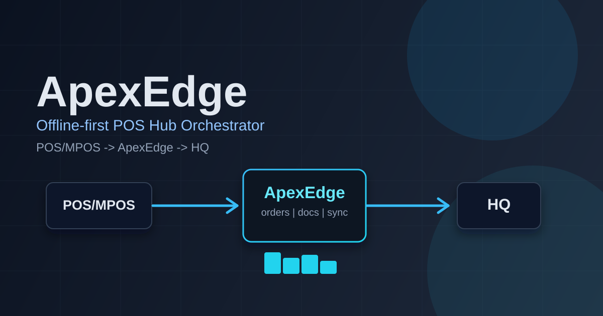

# ApexEdge

[](https://github.com/AncientiCe/apex-edge/actions/workflows/ci.yml)
[](https://github.com/AncientiCe/apex-edge/actions/workflows/smoke-release.yml)
[](https://www.rust-lang.org/)
[](https://www.docker.com/)
[](https://www.sqlite.org/index.html)
[](#license)
[](#build-and-run)

Store hub orchestrator: **POS/MPOS <-> ApexEdge <-> HQ**. Offline-first, contract-driven, with durable order submission and document generation.

## Table of Contents

- [Overview](#overview)
- [Build and run](#build-and-run)
- [Quality gates](#quality-gates)
- [Manual testing: Local POS Simulator](#manual-testing-local-pos-simulator)
- [Testing](#testing)
- [Contracts](#contracts)
- [Security and operations](#security-and-operations)
- [Observability stack](#observability-stack)
- [Crates](#crates)
- [Documentation](#documentation)
- [Project policies](#project-policies)
- [License](#license)

```bash
git clone https://github.com/AncientiCe/apex-edge.git
cd apex-edge
```

## Overview

- **Architecture diagrams:** See [docs/architecture/README.md](docs/architecture/README.md) for high-level mermaid diagrams (system context, bootstrap, routes, POS/document/outbox/sync flows, observability).
- **Northbound**: POS clients send cart/checkout commands; ApexEdge returns cart state or finalize result.
- **Southbound**: HQ syncs catalog, prices, promos, coupons, config; ApexEdge submits orders via durable outbox.
- **Local-first**: All transaction data (catalog, pricing, promos, coupons, config) is available on the hub so checkout does not require external calls.
- **Documents**: Receipt, merchant copy, kitchen chit, etc. are **generated by ApexEdge** and exposed for **POS retrieval**. The POS is responsible for printing.

## Build and run

**Docker (OS-agnostic: Windows, Linux, macOS):**

```bash
docker build -t apex-edge .
docker run -p 3000:3000 -v apex-edge-data:/data apex-edge
```

The image stores the SQLite DB in `/data`; use `-v apex-edge-data:/data` (or any volume/path) to persist it. Override the DB path with `-e APEX_EDGE_DB=/data/apex_edge.db` if needed.

**Local (Rust):**

From the repo root, run the server. The database file is created automatically if it does not exist.

```bash
cargo run -p apex-edge
```

Or build and run the release binary:

```bash
cargo build --release
# Linux / macOS:
APEX_EDGE_DB=./apex_edge.db ./target/release/apex-edge
# Windows (PowerShell):
$env:APEX_EDGE_DB = ".\apex_edge.db"; .\target\release\apex-edge.exe
```

Optional: set `APEX_EDGE_DB` to a path (relative or absolute). Default is `apex_edge.db` in the current working directory.

### Demo data seeding (for POS frontend)

To quickly populate the local DB with plenty of demo categories, products, and customers:

```bash
# Linux / macOS
APEX_EDGE_SEED_DEMO=1 cargo run -p apex-edge

# Windows PowerShell
$env:APEX_EDGE_SEED_DEMO = "1"; cargo run -p apex-edge
```

Or pass a CLI flag:

```bash
cargo run -p apex-edge -- --seed-demo
```

For first-run provisioning on a counter PC or packaged install, run:

```bash
cargo run -p apex-edge -- init
```

This applies migrations, prepares audit signing state, and prints setup details for the operator.

Seeded data is store-scoped to `store_id = 00000000-0000-0000-0000-000000000000` and includes (at minimum):
- 8 categories
- 180 products with prices and descriptions
- 120 customers with codes and emails
- 6 promotions (coupons: SAVE10, FLAT5, VIP20; automatic: spend $20 get 5% off, Beverages 10% off, Buy 2+ Bakery get 15% off Bakery)

- **Health**: `GET /health` — liveness.
- **Ready**: `GET /ready` — readiness (checks DB).
- **POS**: `POST /pos/command` — envelope with `version`, `idempotency_key`, `store_id`, `register_id`, `payload` (see contracts).
- **Documents**: `GET /documents/{id}` and `GET /orders/{order_id}/documents` — fetch generated documents for local POS printing.

## Quality gates

Before pushing or opening a PR, run the same checks as CI:

```bash
make check
```

This runs (in order): `cargo fmt --all -- --check`, `cargo clippy --workspace --all-targets --all-features -- -D warnings`, `cargo test --workspace --all-features`, and `cargo audit`. Individual targets:

- `make fmt` — check formatting (use `make fmt-fix` to fix).
- `make clippy` — lint.
- `make test` — unit, integration, smoke, and full order-flow journey tests.
- `make test-journey` — run only the orchestrator journey tests (create cart → products, customer, promo, payment → finalize → document + HQ payload).
- `make audit` — dependency advisories.

Install `cargo-audit` if missing: `cargo install cargo-audit` (or `make setup`).

## Manual testing: Local POS Simulator

A local-only POS simulator (Vite + React + TypeScript in `frontend/`) drives the hub from a browser. It is a demo and manual-testing client; real POS apps talk to the same API.

### Steps

1. **Start the hub with demo data and dev sign-in.** Auth is on by default, so give the hub an
   external-token secret the simulator can use. Pick a random, local-only value:
   ```bash
   APEX_EDGE_SEED_DEMO=1    APEX_EDGE_STORE_ID=00000000-0000-0000-0000-000000000000    APEX_EDGE_REGISTER_ID=00000000-0000-0000-0000-000000000000    APEX_EDGE_AUTH_EXTERNAL_ISSUER=https://issuer.example    APEX_EDGE_AUTH_EXTERNAL_AUDIENCE=mpos    APEX_EDGE_AUTH_EXTERNAL_HS256_SECRET=<local-secret>    cargo run -p apex-edge
   ```
   The simulator uses the nil store/register ids, so pin the hub to them.
2. **Start the simulator.** Copy `frontend/.env.local.example` to `frontend/.env.local`, set
   `VITE_AUTH_EXTERNAL_HS256_SECRET` to the same `<local-secret>`, then
   `cd frontend && npm install && npm run dev` and open `http://localhost:5173`.
3. **Sign in.** Click **Health** and **Ready** (expect `ok` / `ready`), then **Pair & Sign In**.
   **Pass:** the header shows *Authenticated*.
4. **Sell.** In **Catalog**, add a few products; in **Cart**, press **Pay**; enter a cash amount
   ≥ the total. **Pass:** the order finalizes automatically and the summary shows an order id;
   **Print Receipt** / **Gift Receipt** fetch documents for it.
5. **Store Ops** (bottom tab):
   - **Till:** enter a float, **Open Till**, **X Report** (expected drawer total), then enter the
     counted cash and **Close Till**. **Pass:** variance is shown and the shift reads *closed*.
     Reloading the page mid-shift and pressing **Open Till** picks the open shift back up.
   - **Parked carts:** with items in the cart, **Park Current Cart** (optional note), then
     **Refresh Parked** and **Recall**. **Pass:** the cart comes back in **Cart**.
   - **Returns:** after a sale, **Return Last Sale**. **Pass:** `Return <id> finalized, refunded
     $X cash`.
6. **Negative checks.** Search for an unknown SKU or customer, or open a till twice. **Pass:** the
   error appears as a toast and in **Show event log**; nothing crashes.

## Testing

- **Unit / integration**: `cargo test --workspace --all-features` (or `make test`). Covers all crates plus the apex-edge binary tests.
- **Smoke tests**: In-process server tests in `apex-edge/tests/smoke_http.rs` hit `/health`, `/ready`, and a minimal POS `create_cart` flow; they start the app on a random port and use an in-memory SQLite DB.
- **Full order flow (journey)**: `apex-edge/tests/orchestrator_journey.rs` runs create cart → search/add product → search/add customer → add second product → assert 20% automatic promotion → receive payment → place order → generate document → assert document content and full HQ outbox payload. Run with `make test-journey` or as part of `make test`.
- **Conformance probe**: `tools/conformance` validates deployed hub basics (`/health`, `/ready`, `/openapi.json`) and returns a JSON report. Set `APEX_EDGE_CONFORMANCE_URL` to target a non-local hub.
- **Release smoke**: The `.github/workflows/smoke-release.yml` job builds the Docker image, runs the container, and asserts `/health`, `/ready`, and `POST /pos/command` (create_cart) with `curl`.

## Contracts

- **POS <-> ApexEdge**: `PosRequestEnvelope<PosCommand>`, `PosResponseEnvelope<T>`, `CartState`, `FinalizeResult`. See `crates/contracts` and [docs/contracts/](docs/contracts/README.md).
- **ApexEdge -> HQ**: `HqOrderSubmissionEnvelope` (with `submission_id`, `sequence_number`, `checksum`). Idempotent ingest expected.

## Security and operations

- **Secrets**: Use env or a secret store for DB path and HQ URL; no secrets in logs.
- **Transport**: In production use TLS (e.g. mTLS for HQ). Encryption at rest for DB is deployment-specific.
- **Audit**: Order finalization and HQ submission can be recorded via `apex_edge_storage::audit::record`.
- **Observability**: Structured logging (tracing); health/ready for DB. **Prometheus metrics** are exposed at `GET /metrics` when the app is started with the default binary (recorder installed). See [Metrics](#metrics) for the catalog and usage.
- **Vulnerability reporting**: See [SECURITY.md](SECURITY.md).

### Observability stack

Run ApexEdge first (for example `cargo run -p apex-edge`), then in a second terminal:

```bash
make observability-up     # starts Prometheus (:9090) and Grafana (:3001)
make observability-down   # stops the stack
```

Default local Grafana credentials are `admin` / `admin`. Provisioned dashboards:
- Edge System Health
- Dependencies & Data Flows
- Transaction Journey

For full setup, validation, PromQL signals, and shutdown procedures, see [docs/runbook/README.md](docs/runbook/README.md) section 7.

### Metrics

Metrics are Prometheus-style (counters, histograms, gauges) with an `apex_edge_` prefix and bounded label cardinality. Scrape `GET /metrics` (e.g. `http://localhost:3000/metrics`) and point Prometheus at this target.

| Family | Type | Labels | Description |
|--------|------|--------|--------------|
| `apex_edge_http_requests_total` | counter | `method`, `route`, `status_class` | Total HTTP requests by route and outcome |
| `apex_edge_http_request_duration_seconds` | histogram | `route` | Request latency by route |
| `apex_edge_http_requests_in_flight` | gauge | `route` | In-flight requests by route |
| `apex_edge_pos_commands_total` | counter | `operation`, `outcome` | POS commands (create_cart, add_line_item, finalize_order, etc.) by outcome |
| `apex_edge_pos_command_duration_seconds` | histogram | `operation` | POS command handler duration |
| `apex_edge_payment_attempts_total` | counter | `provider`, `outcome` | Payment attempts by provider (manual, cash, stripe_terminal, adyen_terminal, etc.) |
| `apex_edge_payment_duration_seconds` | histogram | `provider` | Payment operation duration by provider |
| `apex_edge_tax_quote_total` | counter | `provider`, `outcome` | Tax quote attempts by provider |
| `apex_edge_tax_quote_duration_seconds` | histogram | `provider` | Tax quote duration by provider |
| `apex_edge_hardware_operations_total` | counter | `device`, `operation`, `outcome` | Hardware operations for printer, drawer, scanner, scale, and customer display |
| `apex_edge_hardware_operation_duration_seconds` | histogram | `device`, `operation` | Hardware operation duration |
| `apex_edge_store_operations_total` | counter | `operation`, `outcome` | Suspended sale and time-clock operations |
| `apex_edge_store_operation_duration_seconds` | histogram | `operation` | Suspended sale and time-clock operation duration |
| `apex_edge_gift_card_operations_total` | counter | `operation`, `outcome` | Gift card issue, activate, reload, and redeem outcomes |
| `apex_edge_loyalty_operations_total` | counter | `operation`, `outcome` | Loyalty earn and redeem outcomes |
| `apex_edge_cloud_connector_deliveries_total` | counter | `connector`, `outcome` | Cloud connector delivery outcomes |
| `apex_edge_cloud_connector_delivery_duration_seconds` | histogram | `connector` | Cloud connector delivery duration |
| `apex_edge_stock_operations_total` | counter | `operation`, `outcome` | Stock receipt, transfer, count, and adjustment outcomes |
| `apex_edge_fiscal_receipts_total` | counter | `provider`, `outcome` | Fiscal receipt signing outcomes |
| `apex_edge_document_operations_total` | counter | `operation`, `outcome` | Document get/list by outcome (hit, not_found, error) |
| `apex_edge_document_operation_duration_seconds` | histogram | `operation` | Document operation duration |
| `apex_edge_outbox_dispatch_attempts_total` | counter | `outcome` | Outbox dispatch attempts (accepted, rejected, http_error, timeout) |
| `apex_edge_outbox_dispatch_duration_seconds` | histogram | — | HQ HTTP call duration |
| `apex_edge_outbox_dlq_total` | counter | — | Messages moved to dead-letter queue |
| `apex_edge_outbox_dispatcher_cycles_total` | counter | `outcome` | Background dispatcher loop cycle outcomes |
| `apex_edge_sync_ingest_batches_total` | counter | `entity`, `outcome` | Sync ingest batches by entity and outcome |
| `apex_edge_sync_ingest_duration_seconds` | histogram | `entity` | Sync batch processing duration |
| `apex_edge_db_operations_total` | counter | `operation`, `outcome` | DB operations (get_document, fetch_pending_outbox, etc.) |
| `apex_edge_db_operation_duration_seconds` | histogram | `operation` | DB operation duration |
| `apex_edge_catalog_stock_checks_total` | counter | `outcome` | Stock availability checks during add-to-cart |
| `apex_edge_catalog_product_by_id_total` | counter | `outcome` | Product-by-id endpoint hits |
| `apex_edge_catalog_prices_total` | counter | `outcome` | Catalog prices endpoint requests |
| `apex_edge_catalog_product_image_selection_total` | counter | `source` | Source selected for product image URLs |
| `apex_edge_document_render_total` | counter | `document_type`, `outcome` | Document render attempts |
| `apex_edge_document_render_duration_seconds` | histogram | `document_type` | Document render duration |
| `apex_edge_orders_finalized_total` | counter | `outcome` | Durable order ledger writes by outcome |
| `apex_edge_orders_lookup_total` | counter | `operation`, `outcome` | Order ledger get/list requests by outcome |
| `apex_edge_orders_ledger_write_duration_seconds` | histogram | — | Durable order ledger write duration |
| `apex_edge_dependency_http_requests_total` | counter | `status_class`, `outcome` | Outbound HTTP requests to dependencies |
| `apex_edge_dependency_http_duration_seconds` | histogram | — | Outbound dependency HTTP call duration |
| `apex_edge_auth_requests_total` | counter | `operation`, `outcome` | Auth route requests by operation/outcome |
| `apex_edge_auth_request_duration_seconds` | histogram | `operation` | Auth route request duration |
| `apex_edge_auth_sessions_total` | counter | `outcome` | Session exchange/refresh/revoke outcomes |
| `apex_edge_device_pairings_total` | counter | `outcome` | Device pairing outcomes |

**Usage**: Configure Prometheus to scrape the ApexEdge instance (e.g. add to `scrape_configs`). Example alert seeds: high 5xx rate on `apex_edge_http_requests_total`, high latency on `apex_edge_http_request_duration_seconds`, non-zero `apex_edge_outbox_dlq_total`, or `apex_edge_db_operations_total` with `outcome="error"`.

## Crates

| Crate | Role |
|-------|------|
| `apex-edge-contracts` | POS/HQ and sync data shapes, versioning |
| `apex-edge-domain` | Cart state machine, pricing/promo/coupon pipeline, order |
| `apex-edge-storage` | SQLite persistence, migrations, outbox, documents, audit, idempotency |
| `apex-edge-sync` | Async ingest with checkpoints and conflict policy |
| `apex-edge-outbox` | Durable outbox dispatcher (retry, backoff, DLQ) |
| `apex-edge-printing` | Document generation (render + persist for POS retrieval) |
| `apex-edge-metrics` | Prometheus metric names, labels, and recorder bootstrap |
| `apex-edge-adapters-payment` | Payment provider adapter trait and Cash, Stripe Terminal, and simulated-terminal providers (wired into `add_payment`) |
| `apex-edge-adapters-tax` | Tax provider trait (Internal/Avalara/Stripe Tax). **Not wired into the hub:** cart tax is computed by `apex-edge-domain` pricing from synced `TaxRule`s |
| `apex-edge-adapters-hardware` | Hardware adapter traits and ESC/POS, drawer, scanner, scale, and display reference implementations |
| `apex-edge-adapters-cloud` | Cloud connector trait. **Not wired into the hub:** outbox delivery, including signed webhooks, lives in `apex-edge-outbox` |
| `apex-edge-adapters-fiscal` | Fiscal provider trait with NoOp, DE-TSE, and Fiskaly providers plus fiscal exports |
| `apex-edge-giftcards` | Local-first gift card state machine |
| `apex-edge-loyalty` | Loyalty provider trait and local earn/redeem implementation |
| `apex-edge-api` | HTTP API (POS, health, ready, documents) |
| `apex-edge` | Binary entrypoint |

## Documentation

| Document | Description |
|----------|-------------|
| [Architecture](docs/architecture/README.md) | System context, bootstrap, routes, POS/outbox/sync/observability diagrams |
| [Contracts](docs/contracts/README.md) | POS ↔ ApexEdge and ApexEdge → HQ message shapes |
| [Runbook](docs/runbook/README.md) | Deployment, environment variables, health checks, observability stack setup (section 7), troubleshooting, go/no-go checklist |
| [Changelog](CHANGELOG.md) | Release history |

## Project policies

| Policy | Description |
|--------|-------------|
| [Contributing](CONTRIBUTING.md) | How to set up, develop, and submit changes |
| [Security](SECURITY.md) | How to report vulnerabilities privately |
| [Code of Conduct](CODE_OF_CONDUCT.md) | Community standards |

## License

Licensed under either of:

- [MIT License](LICENSE-MIT)
- [Apache License, Version 2.0](LICENSE-APACHE)

at your option.

Unless you explicitly state otherwise, any contribution intentionally submitted for
inclusion in this project shall be dual-licensed as above, without any additional terms
or conditions.
