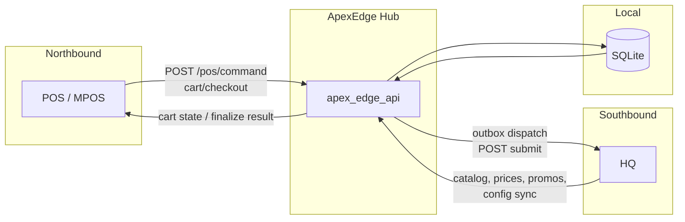
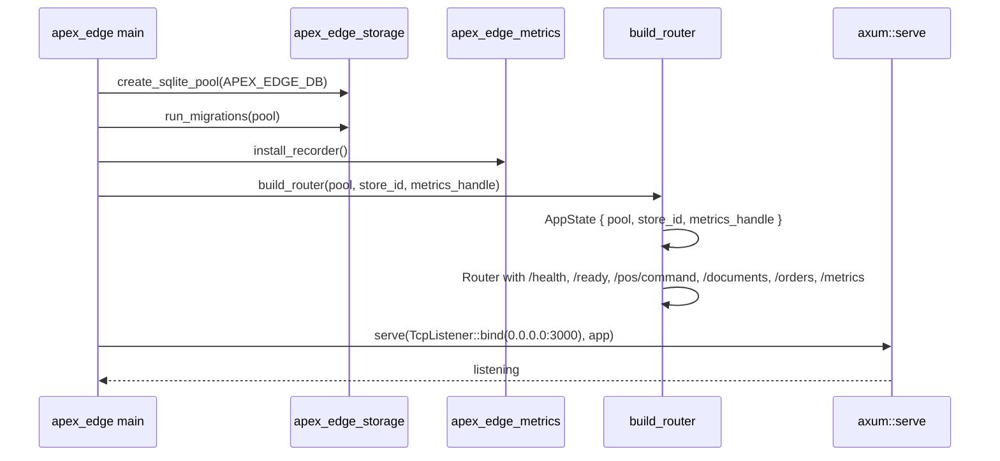
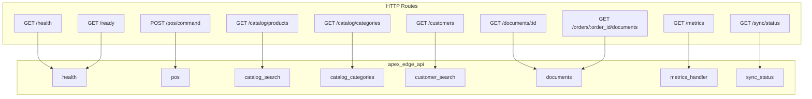
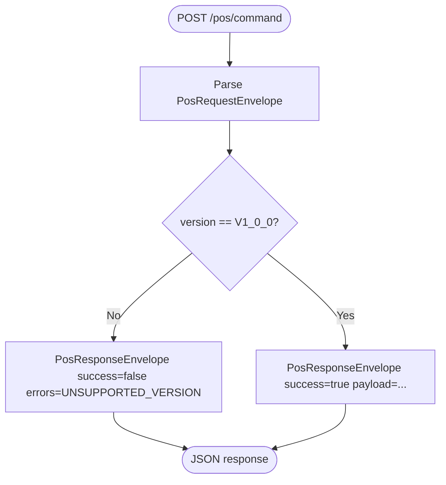
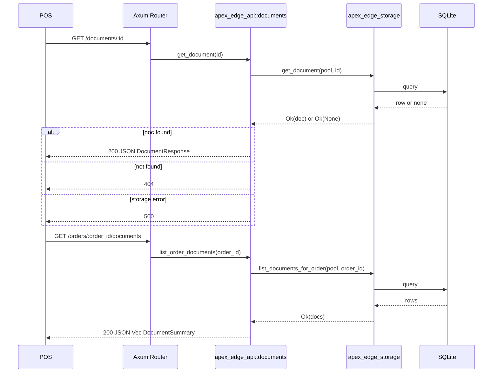
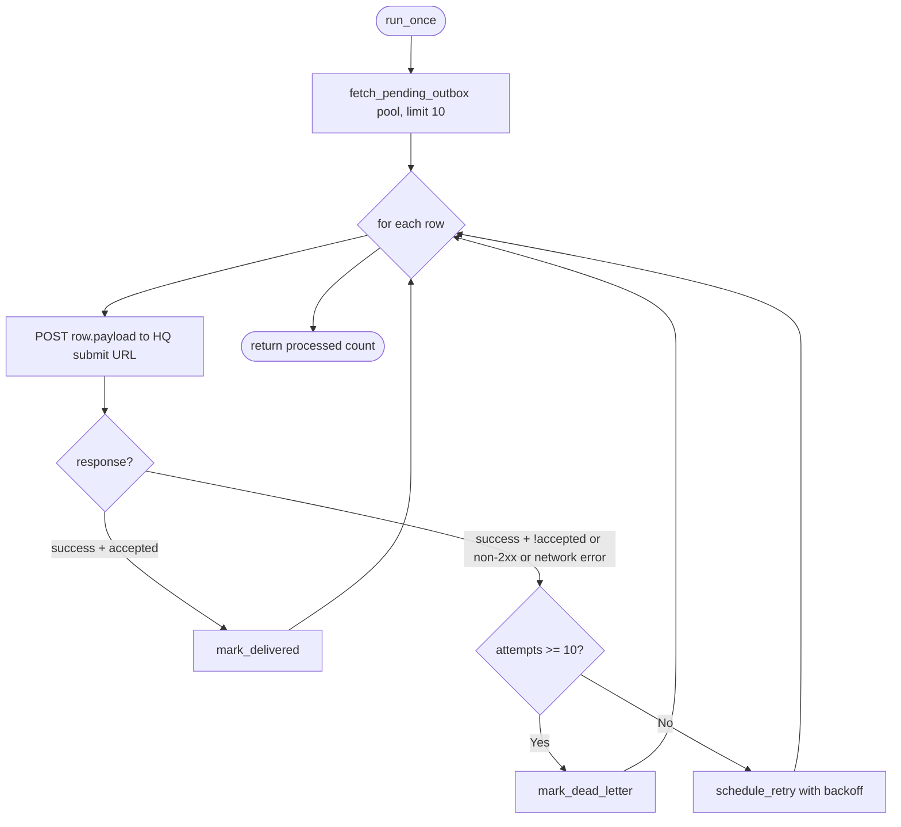
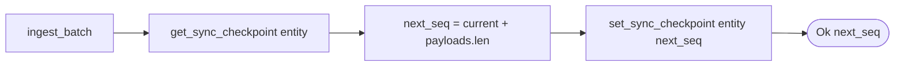
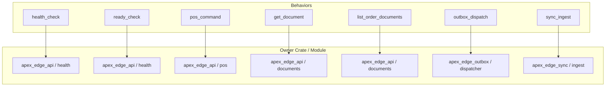
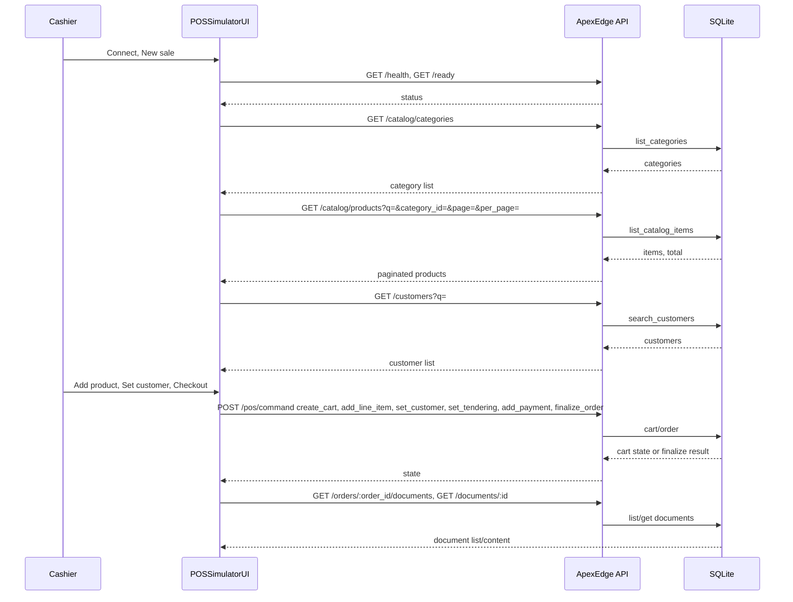
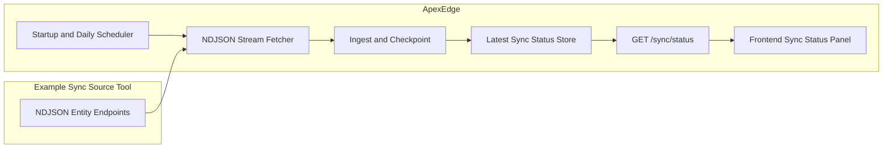

# ApexEdge Architecture

- **POS/MPOS** <-> **ApexEdge** (northbound): cart, checkout, payment, finalize.
- **ApexEdge** <-> **HQ** (southbound): data sync in, order submission out (durable outbox).
- **Local-first**: catalog, prices, promos, coupons, config available on hub; sync is async with checkpoints.
- **Print**: persistent queue, template rendering, device adapters (ESC/POS, PDF, network).

See plan for full component list and phased delivery.

---

## Mermaid Diagrams

High-level, transparent diagrams for each major system piece. Each section has purpose, diagram, and interpretation notes.

### 1. System Context

**Purpose:** Show actors and trust boundaries: northbound (POS), southbound (HQ), and local persistence.

**Notes:**
- **Inputs:** POS sends `PosRequestEnvelope`; HQ pushes catalog/prices/promos/config; ApexEdge reads/writes SQLite.
- **Outputs:** POS gets `PosResponseEnvelope` (cart state or finalize); HQ receives `HqOrderSubmissionEnvelope`; documents are generated and stored for POS retrieval.
- **Trust boundaries:** External = POS, HQ; local = SQLite; ApexEdge is the single hub between them.

### 2. Runtime Bootstrap

**Purpose:** Startup sequence from binary entrypoint to listening server (DB, migrations, metrics, router).

**Notes:**
- **Inputs:** Env `APEX_EDGE_DB` (default `apex_edge.db`); optional metrics handle for `/metrics`.
- **Outputs:** HTTP server on port 3000; DB migrated; routes and shared state wired.
- **Failure path:** Pool or migration failure exits main; server bind failure propagates.

### 3. HTTP Surface (Routes and Owners)

**Purpose:** Map every HTTP route to handler and owner crate/module for tracing and metrics ownership.

**Notes:**
- **Inputs:** Incoming requests to the listed paths; `/ready` and document/pos handlers use `AppState` (pool).
- **Outputs:** JSON or Prometheus scrape; `/ready` returns 503 if DB probe fails.
- **Ownership:** All route behaviors owned by `apex-edge-api`; health = `health` module; pos = `pos`; documents = `documents`; metrics = `metrics_handler`. See [METRICS_BEHAVIORS.md](../METRICS_BEHAVIORS.md).

### 4. POS Command Flow

**Purpose:** Envelope validation and version gate; success vs unsupported-version response.

**Notes:**
- **Inputs:** `PosRequestEnvelope<PosCommand>` with `version`, `idempotency_key`, `store_id`, `register_id`, `payload`.
- **Outputs:** `PosResponseEnvelope` — either success with payload or failure with `PosError` code `UNSUPPORTED_VERSION`.
- **Failure path:** Unsupported contract version returns 200 with `success: false` and errors; no 4xx/5xx for version mismatch (contract-defined).

### 5. Document Retrieval Flow

**Purpose:** `get_document` and `list_order_documents`: request → storage → response with status codes.

**Notes:**
- **Inputs:** `GET /documents/:id` (UUID); `GET /orders/:order_id/documents` (order UUID). Both use shared `AppState.pool`.
- **Outputs:** Single document (content, status, mime_type) or list of document summaries; 404 when document missing; 500 on storage error.
- **Failure path:** Storage errors map to 500; missing document to 404. List endpoint returns 500 on storage error only.

### 6. Outbox Dispatch Flow

**Purpose:** Background cycle: poll pending outbox, POST to HQ, accepted vs retry vs dead-letter; backoff at high level.

**Notes:**
- **Inputs:** `pool`, HTTP `client`, `hq_submit_url`; pending rows from `apex_edge_storage::outbox`.
- **Outputs:** Rows marked delivered when HQ returns success and `accepted`; retry scheduled with exponential backoff (capped); DLQ when `MAX_ATTEMPTS` (10) reached.
- **Failure path:** Network or non-success response increments attempts; after 10 attempts row is marked dead-letter; otherwise `schedule_retry` with backoff.

### 7. Sync Ingest Flow

**Purpose:** Batch ingest with per-entity checkpoint and conflict-policy placeholder.

**Notes:**
- **Inputs:** `pool`, `entity` (e.g. catalog), `ContractVersion`, `payloads` (batch), `ConflictPolicy` (e.g. HqWins). Checkpoint read/write via `apex_edge_storage`.
- **Outputs:** New checkpoint value (sequence) returned; checkpoint advanced atomically per batch.
- **Failure path:** Storage or invalid payload returns `IngestError`; conflict policy is accepted but not yet applied in current ingest (placeholder for future behavior).

### 8. Observability and Behavior Ownership

**Purpose:** Map behavior names and crate/module ownership for metrics and health; transparency for documentation.

**Notes:**
- **Inputs:** Route or flow (see table in [METRICS_BEHAVIORS.md](../METRICS_BEHAVIORS.md)); health/ready = liveness/readiness; `/metrics` = Prometheus scrape when metrics handle present.
- **Outputs:** Each behavior is the unit of ownership for metrics and tracing; DB probe only in ready_check; document fetch/list via storage; outbox and sync via their crates.
- **Transparency:** Single source of truth for route → behavior → owner is METRICS_BEHAVIORS.md; tiers (Tier 1–5) define implementation priority.

### 9. Local POS Simulator Frontend

**Purpose:** Document the local-only POS simulator UI: a POS-style interface with catalog (categories, product search, pagination), customer search (name/email/code/id), cart, checkout, and documents.

**Notes:**
- **Inputs:** Backend base URL; catalog filters (search q, category, page); customer search q (name, email, code, or id); cart actions and checkout.
- **Outputs:** Categories and paginated product list; customer search results; cart state and finalize result; document list and content.
- **API:** `GET /catalog/categories`, `GET /catalog/products?q=&category_id=&page=&per_page=`, `GET /customers?q=` (and legacy `?code=` for exact code). Products support search by SKU, name, or description; customers by code, name, email, or id.
- **POS commands:** `create_cart`, `add_line_item` (optional `unit_price_override_cents` for positive price override), `set_customer`, `apply_manual_discount` (reason mandatory; kinds: percent_cart, percent_item, fixed_cart, fixed_item), `set_tendering`, `add_payment`, `finalize_order`. Promotions (coupons and automatic) are seeded and applied in pipeline; manual discounts applied after promos and included in order metadata to HQ.
- **Layout:** Mobile-first, app-like UI: fixed bottom tab bar (Customers / Catalog / Sync / Cart) with safe-area insets; 44px minimum touch targets; full viewport height (`100dvh`). At 768px+ nav moves to header; at 1024px (e.g. iPad landscape) content is constrained with larger catalog grid. Event log shown from 768px only.
- **Scope:** Simulator runs as a separate dev server (e.g. Vite on port 5173); CORS enabled. Local use only.

### 10. Example Sync Source and Streamed Sync

**Purpose:** Document the separate example-sync-source tool and how ApexEdge pulls sync data on startup and daily via NDJSON streaming; sync status is persisted and exposed to the frontend.

**Notes:**
- **Example sync source:** Separate binary `tools/example-sync-source`; serves NDJSON per entity (first line `{"total": N}`, then N lines of base64 payload). Contract-only coupling; no app runtime dependencies. Run with `cargo run -p example-sync-source` (default port 3030; `SYNC_SOURCE_PORT` env).
- **ApexEdge sync:** When `APEX_EDGE_SYNC_SOURCE_URL` is set, main runs sync once on startup then spawns a 24h periodic task. `run_sync_ndjson` streams each entity (line-by-line), collects payloads per entity, ingests in batch, advances checkpoints, and updates latest sync run + per-entity status in storage.
- **Sync status:** Stored in `sync_run` (single row) and `entity_sync_status`; exposed at `GET /sync/status`. Frontend Sync tab shows last sync time, run state (idle/syncing), and per-entity progress (current, total, percent, status).
- **Failure path:** Sync errors are logged; latest run is marked `failed` with error message; next scheduled run proceeds after 24h.
