# ApexEdge Architecture

- **POS/MPOS** <-> **ApexEdge** (northbound): cart, checkout, payment, finalize.
- **ApexEdge** <-> **HQ** (southbound): data sync in, order submission out (durable outbox).
- **Local-first**: catalog, prices, promos, coupons, config available on hub; sync is async with checkpoints.
- **Print**: persistent queue, template rendering, device adapters (ESC/POS, PDF, network).

Related: [README](../../README.md) · [Contracts](../contracts/README.md) · [Runbook](../runbook/README.md) · [Contributing](../../CONTRIBUTING.md) · [Security](../../SECURITY.md)

---

## Mermaid Diagrams

High-level, transparent diagrams for each major system piece. Each section has purpose, diagram, and interpretation notes.

### 1. System Context

**Purpose:** Show actors and trust boundaries: northbound (POS), southbound (HQ), and local persistence.

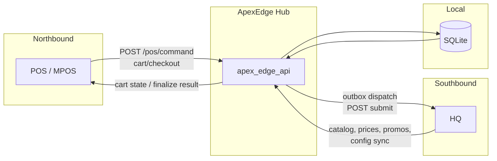

**Notes:**
- **Inputs:** POS sends `PosRequestEnvelope`; HQ pushes catalog/prices/promos/config; ApexEdge reads/writes SQLite.
- **Outputs:** POS gets `PosResponseEnvelope` (cart state or finalize); HQ receives `HqOrderSubmissionEnvelope`; documents are generated and stored for POS retrieval.
- **Trust boundaries:** External = POS, HQ; local = SQLite; ApexEdge is the single hub between them.

### 2. Runtime Bootstrap

**Purpose:** Startup sequence from binary entrypoint to listening server (DB, migrations, sync scheduling, outbox dispatcher, metrics, router).

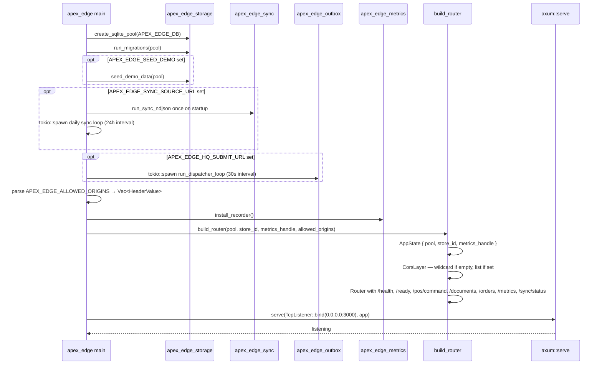

**Notes:**
- **Inputs:** Env `APEX_EDGE_DB` (default `apex_edge.db`); `APEX_EDGE_SYNC_SOURCE_URL` (optional, enables sync); `APEX_EDGE_HQ_SUBMIT_URL` (optional, enables outbox dispatch); `APEX_EDGE_SEED_DEMO` (optional, seeds demo catalog/customers/promotions); `APEX_EDGE_ALLOWED_ORIGINS` (optional, comma-separated; empty = wildcard CORS for local dev, non-empty = restricted).
- **Outputs:** HTTP server on port 3000; DB migrated; optional background sync and dispatcher tasks spawned.
- **Failure path:** Pool or migration failure exits main; server bind failure propagates. Sync and dispatcher errors are logged and retried on next cycle without stopping the process.

### 3. HTTP Surface (Routes and Owners)

**Purpose:** Map every HTTP route to handler and owner crate/module for tracing and metrics ownership.

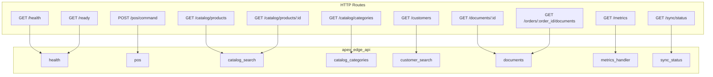

**Notes:**
- **Inputs:** Incoming requests to the listed paths; `/ready` and document/pos handlers use `AppState` (pool).
- **Outputs:** JSON or Prometheus scrape; `/ready` returns 503 if DB probe fails.
- **Ownership:** All route behaviors owned by `apex-edge-api`; health = `health` module; pos = `pos`; documents = `documents`; metrics = `metrics_handler`. See [METRICS_BEHAVIORS.md](../METRICS_BEHAVIORS.md).

### 4. POS Command Flow

**Purpose:** Envelope validation and version gate; success vs unsupported-version response.

**Notes:**
- **Inputs:** `PosRequestEnvelope<PosCommand>` with `version`, `idempotency_key`, `store_id`, `register_id`, `payload`.
- **Outputs:** `PosResponseEnvelope` — either success with payload or failure with `PosError` code `UNSUPPORTED_VERSION`.
- **Failure path:** Unsupported contract version returns 200 with `success: false` and errors; no 4xx/5xx for version mismatch (contract-defined).

### 5. Document Retrieval Flow

**Purpose:** `get_document` and `list_order_documents`: request → storage → response with status codes.

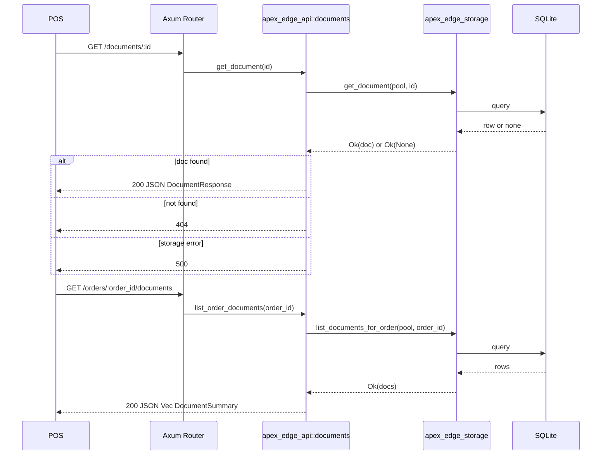

**Notes:**
- **Inputs:** `GET /documents/:id` (UUID); `GET /orders/:order_id/documents` (order UUID). Both use shared `AppState.pool`.
- **Outputs:** Single document (content, status, mime_type) or list of document summaries; 404 when document missing; 500 on storage error.
- **Failure path:** Storage errors map to 500; missing document to 404. List endpoint returns 500 on storage error only.

### 6. Outbox Dispatch Flow

**Purpose:** Background loop fires every 30 seconds; each cycle polls pending outbox rows, POSTs to HQ, and marks accepted/retry/dead-letter. Wired in `main.rs` when `APEX_EDGE_HQ_SUBMIT_URL` is set.

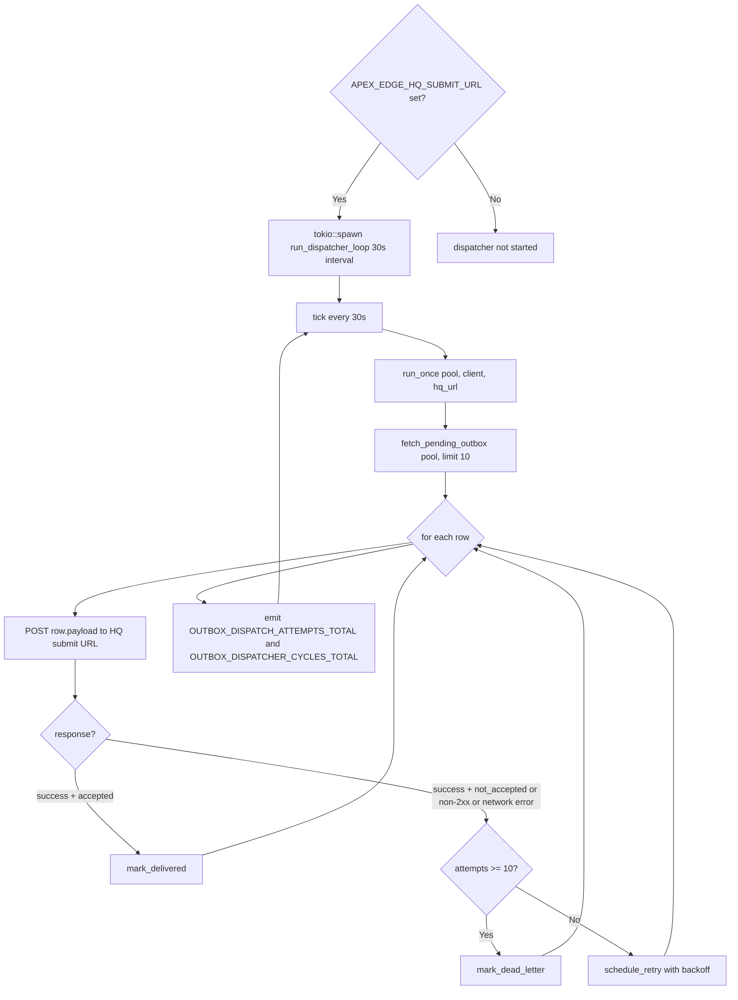

**Notes:**
- **Inputs:** `pool`, HTTP `client`, `APEX_EDGE_HQ_SUBMIT_URL` (env); pending rows from `apex_edge_storage::outbox`. Background loop started once at startup.
- **Outputs:** Rows marked delivered when HQ returns `accepted`; retry scheduled with exponential backoff (base 5s, capped at 320s); DLQ when `MAX_ATTEMPTS` (10) reached.
- **Metrics:** `apex_edge_outbox_dispatch_attempts_total{outcome}`, `apex_edge_outbox_dispatch_duration_seconds`, `apex_edge_outbox_dlq_total`, `apex_edge_outbox_dispatcher_cycles_total{outcome}`.
- **Failure path:** Cycle-level errors (storage, network) are logged and counted; loop continues on next tick without stopping the process.

### 7. Sync Ingest and Entity Application Flow

**Purpose:** Full sync pipeline: fetch NDJSON from HQ, apply each entity to its storage table, then advance the per-entity checkpoint. All entities supported: catalog, categories, price_book, tax_rules, customers, promotions. Unknown entities advance checkpoint without storage (forward-compatibility).

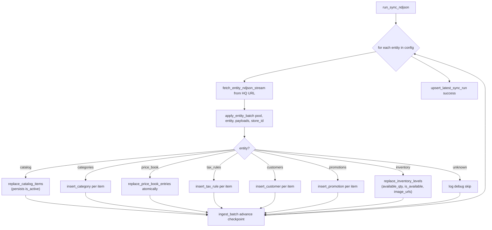

**Notes:**
- **Inputs:** `pool`, `SyncSourceConfig` (base URL + entity paths), `ContractVersion`, `store_id`. Contract types: `CatalogItem`, `Category`, `PriceBook`, `TaxRule`, `Customer`, `Promotion`, `InventoryLevel`.
- **Outputs:** Each entity's data persisted to its storage table; checkpoint advanced per entity; sync run status updated.
- **Metrics:** `apex_edge_sync_ingest_batches_total{entity, outcome}`, `apex_edge_sync_ingest_duration_seconds{entity}`.
- **Failure path:** Invalid JSON payload fails the entity's batch with `IngestError::InvalidPayload`; the whole sync run is marked `failed`; checkpoint does not advance for failed entities; next run retries.
- **price_book:** Synced with delete-and-replace semantics (atomically replaces all price book entries for the store in a transaction).
- **inventory:** Updates `available_qty`, `is_available`, and `image_urls` on existing `catalog_items` rows. Missing item IDs are silently skipped (forward-compatible). Default `available_qty = NULL` means untracked — no stock constraint applied.

### 8. Observability and Behavior Ownership

**Purpose:** Map behavior names and crate/module ownership for metrics and health; transparency for documentation.

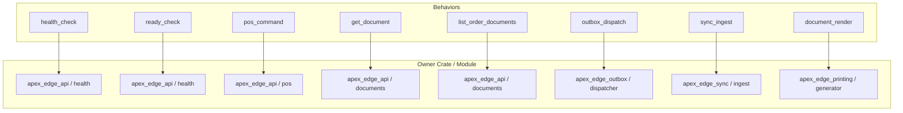

**Notes:**
- **Inputs:** Route or flow (see table in [METRICS_BEHAVIORS.md](../METRICS_BEHAVIORS.md)); health/ready = liveness/readiness; `/metrics` = Prometheus scrape when metrics handle present.
- **Outputs:** Each behavior is the unit of ownership for metrics and tracing; DB probe only in ready_check; document fetch/list via storage; outbox and sync via their crates.
- **Transparency:** Single source of truth for route → behavior → owner is METRICS_BEHAVIORS.md; tiers (Tier 1–5) define implementation priority.

### 9. Local POS Simulator Frontend

**Purpose:** Document the local-only POS simulator UI: a POS-style interface with catalog (categories, product search, pagination), customer search (name/email/code/id), cart, checkout, and documents.

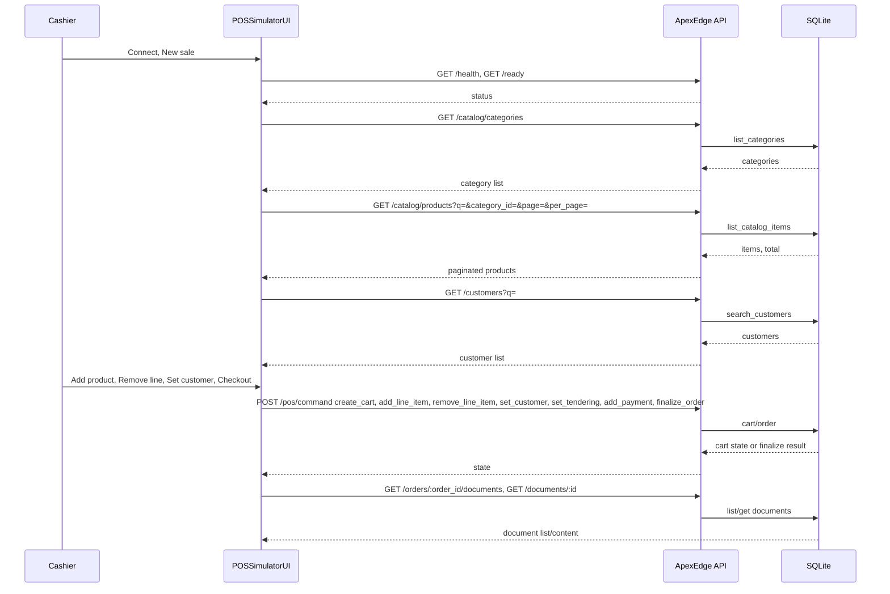

**Notes:**
- **Inputs:** Backend base URL; catalog filters (search q, category, page); customer search q (name, email, code, or id); cart actions and checkout.
- **Outputs:** Categories and paginated product list; customer search results; cart state and finalize result; document list and content.
- **API:** `GET /catalog/categories`, `GET /catalog/products?q=&category_id=&page=&per_page=`, `GET /customers?q=` (and legacy `?code=` for exact code). Products support search by SKU, name, or description; customers by code, name, email, or id.
- **POS commands:** `create_cart`, `add_line_item` (optional `unit_price_override_cents` for positive price override), `remove_line_item` (removes a line by `line_id`; re-runs pricing pipeline on remaining lines; transitions cart back to Open when last line is removed), `set_customer`, `apply_manual_discount` (reason mandatory; kinds: percent_cart, percent_item, fixed_cart, fixed_item), `set_tendering`, `add_payment`, `finalize_order`. Promotions (coupons and automatic) are seeded and applied in pipeline; manual discounts applied after promos and included in order metadata to HQ.
- **Customer on cart:** When `set_customer` succeeds, the API handler looks up the customer record and populates `customer_name` and `customer_code` in `CartState`. Every subsequent command that returns `CartState` also enriches these fields. The cart panel shows a banner with the customer name and code whenever a customer is attached.
- **Layout:** Mobile-first, app-like UI: fixed bottom tab bar (Customers / Catalog / Sync / Cart) with safe-area insets; 44px minimum touch targets; full viewport height (`100dvh`). At 768px+ nav moves to header; at 1024px (e.g. iPad landscape) content is constrained with larger catalog grid. Event log shown from 768px only.
- **Scope:** Simulator runs as a separate dev server (e.g. Vite on port 5173); CORS enabled. Local use only.
- **Product Detail Page:** Clicking "View" on any catalog card navigates to `/product/:id` (URL route). PDP fetches full product via `GET /catalog/products/:id`, displays image gallery (thumbnail strip + main image), availability badge, quantity stepper, and "Add to Cart" button. After add-to-cart, navigates back to `/catalog`. Add-to-cart is disabled when item is inactive or out of stock.
- **Availability in catalog:** Product cards show availability badge (Out of Stock / low stock / In Stock / Available). The "+ Add" button is disabled for out-of-stock or inactive items. Images (first thumbnail) shown when synced.

### 10. Example Sync Source and Streamed Sync

**Purpose:** Document the separate example-sync-source tool and how ApexEdge pulls sync data on startup and daily via NDJSON streaming; sync status is persisted and exposed to the frontend.

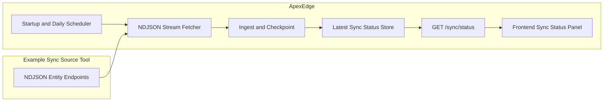

**Notes:**
- **Example sync source:** Separate binary `tools/example-sync-source`; serves NDJSON per entity (first line `{"total": N}`, then N lines of base64 payload). Contract-only coupling; no app runtime dependencies. Run with `cargo run -p example-sync-source` (default port 3030; `SYNC_SOURCE_PORT` env). Entities: catalog, categories, price_book, tax_rules, promotions, customers, coupons, **inventory** (per-item availability + image URLs).
- **ApexEdge sync:** When `APEX_EDGE_SYNC_SOURCE_URL` is set, main runs sync once on startup then spawns a 24h periodic task. `run_sync_ndjson` streams each entity (line-by-line), collects payloads per entity, ingests in batch, advances checkpoints, and updates latest sync run + per-entity status in storage.
- **Sync status:** Stored in `sync_run` (single row) and `entity_sync_status`; exposed at `GET /sync/status`. Frontend Sync tab shows last sync time, run state (idle/syncing), and per-entity progress (current, total, percent, status).
- **Failure path:** Sync errors are logged; latest run is marked `failed` with error message; next scheduled run proceeds after 24h.

### 11. Stock and Availability Sync

**Purpose:** Document how inventory levels and product availability are synced from HQ and enforced on the POS add-to-cart path and exposed in the product catalog API.

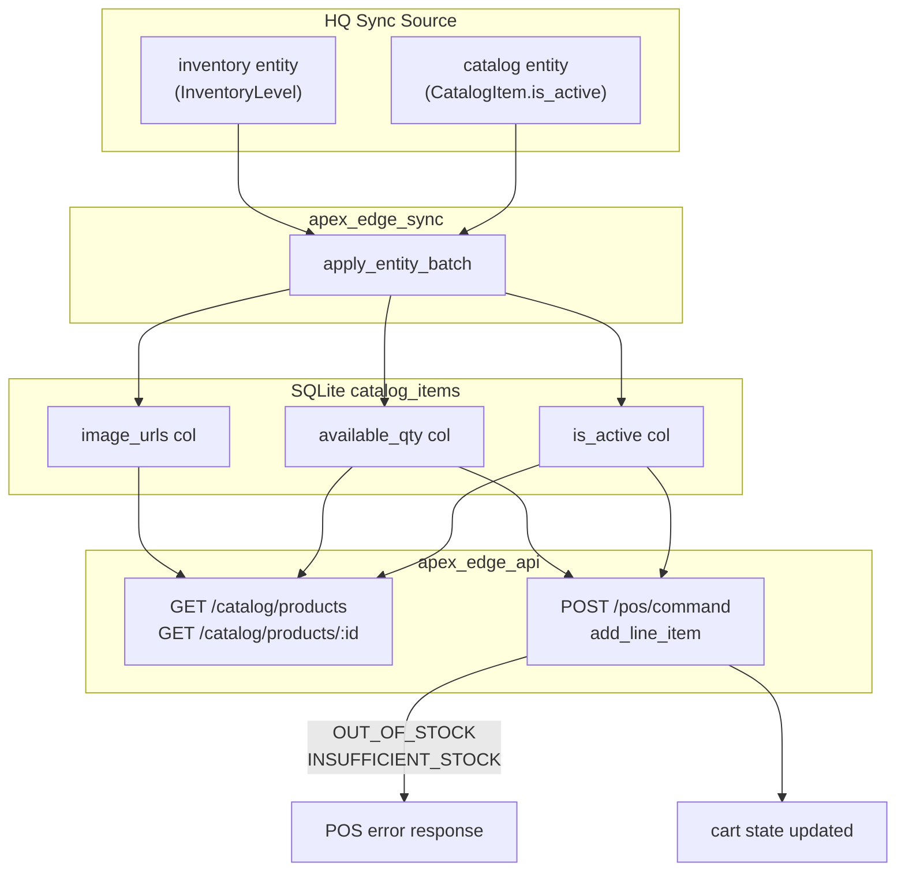

**Notes:**
- **Inputs:** `catalog` sync entity persists `is_active` from `CatalogItem`. `inventory` sync entity persists `available_qty`, `is_available`, and `image_urls` from `InventoryLevel` (per-item, per-store).
- **Outputs:** `ProductSearchResult` now includes `is_active`, `available_qty` (nullable — `null` = untracked), and `image_urls`. `GET /catalog/products/:id` returns full product detail for PDP.
- **Stock enforcement:** `add_line_item` checks `CatalogItemRow::check_quantity` before inserting a line. Returns `OUT_OF_STOCK` if `is_active=false` or `available_qty <= 0`; returns `INSUFFICIENT_STOCK` if `quantity > available_qty`. Items with `available_qty = NULL` (inventory not yet synced) are not constrained.
- **Metrics:** `apex_edge_catalog_stock_checks_total{outcome}` counts add-to-cart stock checks (ok, OUT_OF_STOCK, INSUFFICIENT_STOCK). `apex_edge_catalog_product_by_id_total{outcome}` counts product-by-id requests.
- **Failure path:** HQ may not have inventory synced for all items — defaults to NULL (untracked), which never blocks cart. is_active defaults to 1 (active).

### 12. Product Detail Page (PDP) with Image Gallery

**Purpose:** Document the URL-routed Product Detail Page in the POS simulator frontend; image gallery, quantity stepper, availability badge, and add-to-cart flow.

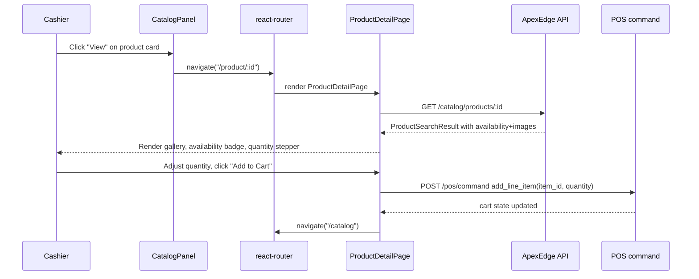

**Notes:**
- **Inputs:** URL parameter `:id` (product UUID). Backend `GET /catalog/products/:id` returns full `ProductSearchResult` including `available_qty`, `is_active`, and `image_urls`.
- **Outputs:** PDP displays product name, SKU, description, availability badge (Out of Stock / low stock / In Stock / Available-untracked), image gallery with thumbnail strip, quantity stepper, and Add to Cart button.
- **Routing:** PDP is at `/product/:id`. CatalogPanel "View" button navigates there. PDP Back button and post-add-to-cart both navigate to `/catalog`. Main POS app continues at `/*` routes.
- **Availability enforcement:** "Add to Cart" button is disabled when `is_active=false` or `available_qty <= 0`. Quantity stepper is capped at `available_qty` when tracked.
- **Image gallery:** Thumbnail strip shows all `image_urls`; clicking a thumbnail swaps the main image. Keyboard-accessible. Falls back to placeholder icon when no images are synced.

### 13. Internal Security Baseline (CORS)

**Purpose:** Document the configurable CORS posture introduced for the v0.1.0 internal-alpha security baseline. By default the hub allows all origins (suitable for local dev); a comma-separated env var locks CORS to an explicit allowlist in controlled deployments.

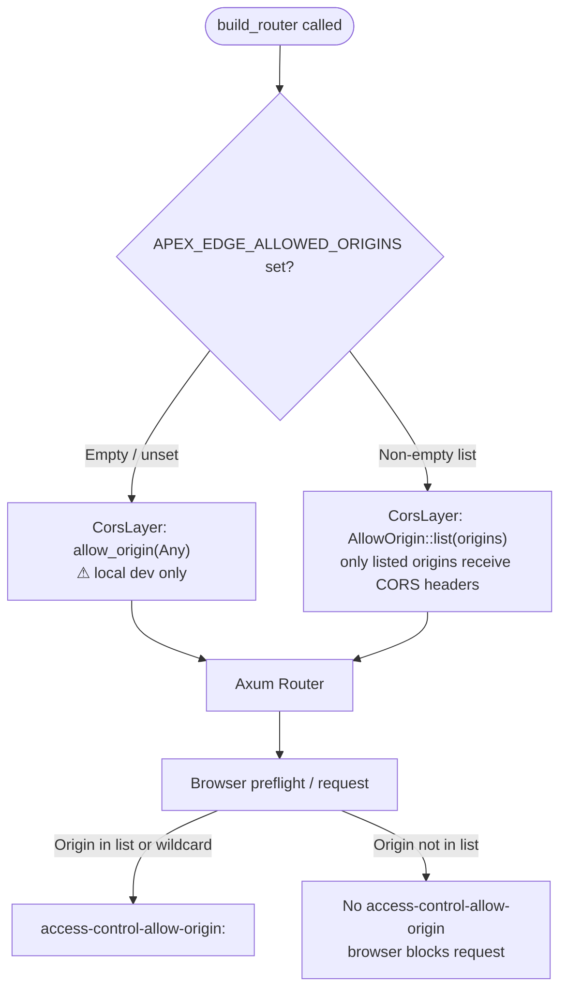

**Notes:**
- **Inputs:** Env `APEX_EDGE_ALLOWED_ORIGINS` — comma-separated list of allowed origins (e.g. `http://localhost:5173,https://pos.example.internal`). Unset or empty = wildcard (logs a warning).
- **Outputs:** `access-control-allow-origin` header on preflight and actual responses; restricted list means unknown origins receive no matching header and browsers enforce the block.
- **Failure path:** Malformed origin strings (not valid `HeaderValue`) are silently skipped; if all entries are invalid the fallback is wildcard with a warning.
- **Tests:** `cors_restricted_trusted_origin_is_allowed` and `cors_restricted_unknown_origin_is_rejected` in `apex-edge/tests/cors_http.rs` verify both branches.

### 14. Synced PDF Receipt Templates

**Purpose:** Document how receipt and gift-receipt documents are produced from synced HTML templates, rendered with cart/order data, and output as PDFs for the POS to open or print.

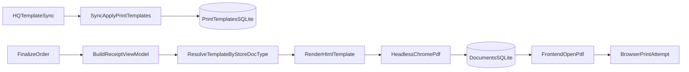

**Notes:**
- **Inputs:** Sync entity `print_templates` with payloads `PrintTemplateConfig` (id, document_type, template_body, version); store_id from sync context. Finalize/gift-receipt use receipt view-model (order_id, store/customer/totals/lines/payments, tenant, logo placeholder).
- **Outputs:** Documents table row with `mime_type application/pdf` and base64-encoded PDF in `content`; frontend opens via Blob URL and attempts print.
- **Template engine:** `{{key}}` substitution and `{{#each key}}...{{/each}}` for arrays; HTML template rendered to PDF via headless Chrome.
- **Failure path:** Missing template falls back to plain-text receipt. Template render error or PDF engine failure marks document as failed and is recorded in `apex_edge_document_render_total{outcome=template_error|pdf_error}`.
- **Metrics:** `apex_edge_document_render_total{document_type, outcome}`, `apex_edge_document_render_duration_seconds{document_type}`. Sync of `print_templates` is covered by `apex_edge_sync_ingest_batches_total{entity=print_templates}`.

### 15. Edge Auth and Device Trust

**Purpose:** Document local hub authentication so mPOS clients can pair once, then exchange external associate identity tokens for hub sessions used to call protected northbound routes.

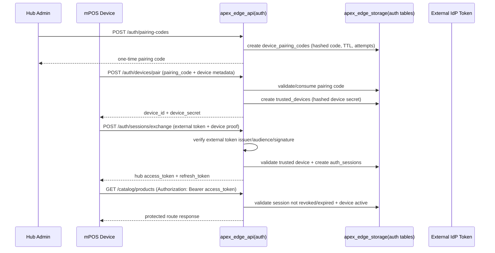

**Notes:**
- **Inputs:** Pairing requests (`store_id`, `created_by`), device metadata (`device_name`, optional `platform`), external associate token (`iss`, `aud`, `sub`, `store_id` claims), and bearer session tokens on protected routes.
- **Outputs:** `trusted_devices`, `device_pairing_codes`, `auth_sessions`, and `associate_identities` persisted locally. Protected routes return `401` when session/device validation fails.
- **Protection scope:** `/pos/*`, `/catalog/*`, `/customers`, `/documents/*`, `/orders/*`, `/sync/status` are protected when auth is enabled. `/health`, `/ready`, and auth bootstrap/session endpoints remain callable as designed.
- **Failure path:** Invalid/expired/consumed pairing code, device mismatch, token validation failure, and revoked/expired sessions all fail closed with `401`/`400`; attempts are tracked on pairing codes.
- **Metrics:** `apex_edge_auth_requests_total{operation,outcome}`, `apex_edge_auth_request_duration_seconds{operation}`, `apex_edge_auth_sessions_total{outcome}`, `apex_edge_device_pairings_total{outcome}`.
