# ApexEdge Architecture

- **POS/MPOS** <-> **ApexEdge** (northbound): cart, checkout, payment, finalize.
- **ApexEdge** <-> **HQ** (southbound): data sync in, order submission out (durable outbox).
- **Local-first**: catalog, prices, promos, coupons, config available on hub; sync is async with checkpoints.
- **Print**: persistent queue, template rendering, device adapters (ESC/POS, PDF, network).

Related: [README](../../README.md) · [Contracts](../contracts/README.md) · [Runbook](../runbook/README.md) · [Contributing](../../CONTRIBUTING.md) · [Security](../../SECURITY.md)

---

## Mermaid Diagrams

High-level, transparent diagrams for each major system piece. Each section has purpose, diagram, and interpretation notes.

### 1. System Context

**Purpose:** Show actors and trust boundaries: northbound (POS), southbound (HQ), and local persistence.

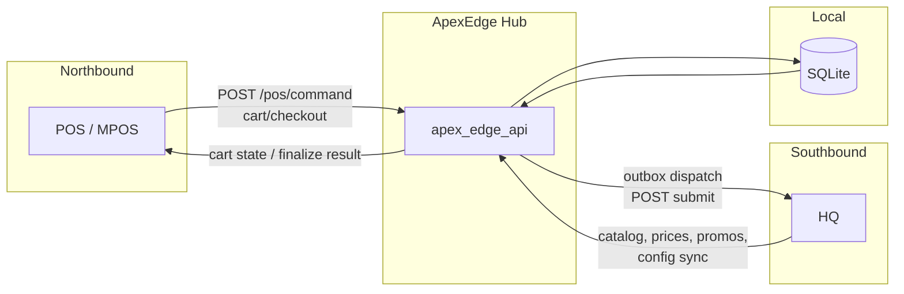
```mermaid
flowchart LR
    subgraph northbound [Northbound]
        POS[POS / MPOS]
    end
    subgraph apex [ApexEdge Hub]
        API[apex_edge_api]
    end
    subgraph southbound [Southbound]
        HQ[HQ]
    end
    subgraph local [Local]
        SQLite[(SQLite)]
    end
    POS -->|"POST /pos/command\ncart/checkout"| API
    API -->|"cart state / finalize result"| POS
    API --> SQLite
    SQLite --> API
    API -->|"outbox dispatch\nPOST submit"| HQ
    HQ -->|"catalog, prices, promos,\nconfig sync"| API
```

**Notes:**
- **Inputs:** POS sends `PosRequestEnvelope`; HQ pushes catalog/prices/promos/config; ApexEdge reads/writes SQLite.
- **Outputs:** POS gets `PosResponseEnvelope` (cart state or finalize); HQ receives `HqOrderSubmissionEnvelope`; documents are generated and stored for POS retrieval.
- **Trust boundaries:** External = POS, HQ; local = SQLite; ApexEdge is the single hub between them.

### 2. Runtime Bootstrap

**Purpose:** Startup sequence from binary entrypoint to listening server (DB, migrations, sync scheduling, outbox dispatcher, metrics, router).

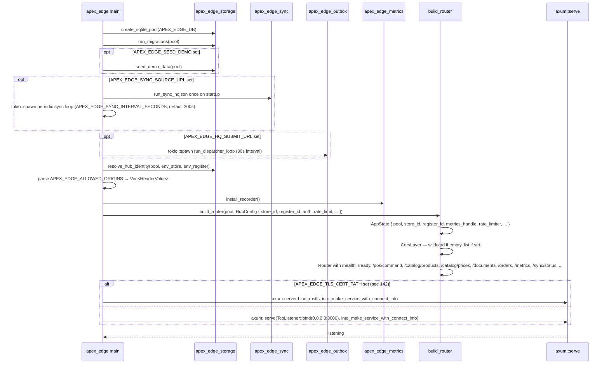
```mermaid
sequenceDiagram
    participant Main as apex_edge main
    participant Storage as apex_edge_storage
    participant Sync as apex_edge_sync
    participant Outbox as apex_edge_outbox
    participant Metrics as apex_edge_metrics
    participant App as build_router
    participant Axum as axum::serve
    Main->>Storage: create_sqlite_pool(APEX_EDGE_DB)
    Main->>Storage: run_migrations(pool)
    opt APEX_EDGE_SEED_DEMO set
        Main->>Storage: seed_demo_data(pool)
    end
    opt APEX_EDGE_SYNC_SOURCE_URL set
        Main->>Sync: run_sync_ndjson once on startup
        Main->>Main: tokio::spawn periodic sync loop (APEX_EDGE_SYNC_INTERVAL_SECONDS, default 300s)
    end
    opt APEX_EDGE_HQ_SUBMIT_URL set
        Main->>Outbox: tokio::spawn run_dispatcher_loop (30s interval)
    end
    Main->>Storage: resolve_hub_identity(pool, env_store, env_register)
    Main->>Main: parse APEX_EDGE_ALLOWED_ORIGINS → Vec<HeaderValue>
    Main->>Metrics: install_recorder()
    Main->>App: build_router(pool, HubConfig { store_id, register_id, auth, rate_limit, ... })
    App->>App: AppState { pool, store_id, register_id, metrics_handle, rate_limiter, ... }
    App->>App: CorsLayer — wildcard if empty, list if set
    App->>App: Router with /health, /ready, /pos/command, /catalog/products, /catalog/prices, /documents, /orders, /metrics, /sync/status, ...
    alt APEX_EDGE_TLS_CERT_PATH set (see §42)
        Main->>Axum: axum-server bind_rustls, into_make_service_with_connect_info
    else
        Main->>Axum: axum::serve(TcpListener::bind(0.0.0.0:3000), into_make_service_with_connect_info)
    end
    Axum-->>Main: listening
```

**Notes:**
- **Inputs:** Env `APEX_EDGE_DB` (default `apex_edge.db`); `APEX_EDGE_STORE_ID` / `APEX_EDGE_REGISTER_ID` (optional, see §42); `APEX_EDGE_SYNC_SOURCE_URL` (optional, enables sync); `APEX_EDGE_SYNC_INTERVAL_SECONDS` (optional, periodic sync interval in seconds; default `300`); `APEX_EDGE_HQ_SUBMIT_URL` (optional, enables outbox dispatch); `APEX_EDGE_SEED_DEMO` (optional, seeds demo catalog/customers/promotions); `APEX_EDGE_ALLOWED_ORIGINS` (optional, comma-separated; empty = wildcard CORS for local dev, non-empty = restricted); `APEX_EDGE_AUTH_ENABLED` (default **on** — see §16); `APEX_EDGE_TLS_*` (optional, see §42).
- **Outputs:** HTTP or HTTPS server on port 3000; DB migrated; optional background sync and dispatcher tasks spawned.
- **Failure path:** Pool or migration failure exits main; server bind failure propagates. Sync and dispatcher errors are logged and retried on next cycle without stopping the process.

### 3. HTTP Surface (Routes and Owners)

**Purpose:** Map every HTTP route to handler and owner crate/module for tracing and metrics ownership.

```mermaid
flowchart TB
    subgraph routes [HTTP Routes]
        R1["GET /health"]
        R2["GET /ready"]
        Auth["POST /auth/*"]
        PosCommand["POST /pos/command"]
        PosCart["GET /pos/cart/:cart_id"]
        PosStream["GET /pos/stream and /pos/events"]
        Catalog["GET /catalog/products, /catalog/products/:id, /catalog/prices, /catalog/categories"]
        Customers["GET /customers"]
        Docs["GET /documents/:id and /orders/:order_id/documents"]
        GiftDocs["POST /orders/:order_id/documents/gift-receipt"]
        Orders["GET /orders and /orders/:id"]
        Audit["GET /audit/verify"]
        Approvals["POST/GET /approvals*"]
        Ops["GET /metrics, /sync/status, /openapi.json, /docs"]
    end
    subgraph api [apex_edge_api]
        H[health]
        A[auth]
        P[pos]
        S[stream]
        C[catalog_search]
        CC[catalog_categories]
        CS[customer_search]
        D[documents]
        O[orders]
        AU[audit]
        AP[approvals]
        M[metrics_handler]
        SS[sync_status]
        OA[openapi]
    end
    R1 --> H
    R2 --> H
    Auth --> A
    PosCommand --> P
    PosCart --> P
    PosStream --> S
    Catalog --> C
    Catalog --> CC
    Customers --> CS
    Docs --> D
    GiftDocs --> D
    Orders --> O
    Audit --> AU
    Approvals --> AP
    Ops --> M
    Ops --> SS
    Ops --> OA
```

**Notes:**
- **Inputs:** Incoming requests to the listed paths; most handlers use `AppState` for the store id, SQLite pool, auth settings, stream hub, and hub role.
- **Outputs:** JSON, Prometheus scrape, WebSocket/SSE streams, or docs HTML; `/ready` returns 503 if DB probe fails.
- **Ownership:** All route behaviors are owned by `apex-edge-api`; the router in `apex-edge/src/app.rs` remains the ground truth. See section 9 for behavior ownership and section 20 for observability mapping.

### 4. POS Command Flow

**Purpose:** Envelope validation and version gate; success vs unsupported-version response.

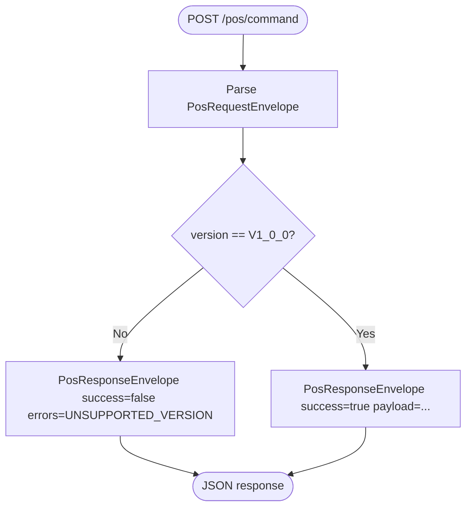
```mermaid
flowchart TB
    Start([POST /pos/command]) --> Parse[Parse PosRequestEnvelope]
    Parse --> CheckVersion{version == V1_0_0?}
    CheckVersion -->|No| ErrVersion[PosResponseEnvelope success=false errors=UNSUPPORTED_VERSION]
    CheckVersion -->|Yes| Success[PosResponseEnvelope success=true payload=...]
    ErrVersion --> Response([JSON response])
    Success --> Response
```

**Notes:**
- **Inputs:** `PosRequestEnvelope<PosCommand>` with `version`, `idempotency_key`, `store_id`, `register_id`, `payload`.
- **Outputs:** `PosResponseEnvelope` — either success with payload or failure with `PosError` code `UNSUPPORTED_VERSION`.
- **Failure path:** Unsupported contract version returns 200 with `success: false` and errors; no 4xx/5xx for version mismatch (contract-defined).

### 5. Document Retrieval Flow

**Purpose:** `get_document` and `list_order_documents`: request → storage → response with status codes.

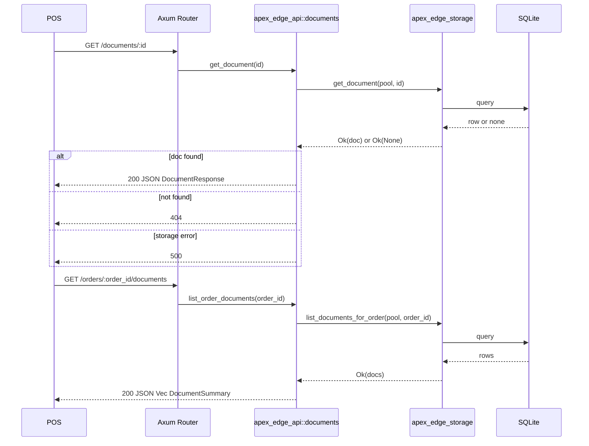
```mermaid
sequenceDiagram
    participant Client as POS
    participant Router as Axum Router
    participant Docs as apex_edge_api::documents
    participant Storage as apex_edge_storage
    participant DB as SQLite
    Client->>Router: GET /documents/:id
    Router->>Docs: get_document(id)
    Docs->>Storage: get_document(pool, id)
    Storage->>DB: query
    DB-->>Storage: row or none
    Storage-->>Docs: Ok(doc) or Ok(None)
    alt doc found
        Docs-->>Client: 200 JSON DocumentResponse
    else not found
        Docs-->>Client: 404
    else storage error
        Docs-->>Client: 500
    end
    Client->>Router: GET /orders/:order_id/documents
    Router->>Docs: list_order_documents(order_id)
    Docs->>Storage: list_documents_for_order(pool, order_id)
    Storage->>DB: query
    DB-->>Storage: rows
    Storage-->>Docs: Ok(docs)
    Docs-->>Client: 200 JSON Vec DocumentSummary
```

**Notes:**
- **Inputs:** `GET /documents/:id` (UUID); `GET /orders/:order_id/documents` (order UUID). Both use shared `AppState.pool`.
- **Outputs:** Single document (content, status, mime_type) or list of document summaries; 404 when document missing; 500 on storage error.
- **Failure path:** Storage errors map to 500; missing document to 404. List endpoint returns 500 on storage error only.

### 6. Outbox Dispatch Flow

**Purpose:** Background loop fires every 30 seconds; each cycle polls pending outbox rows, POSTs to HQ, and marks accepted/retry/dead-letter. Wired in `main.rs` when `APEX_EDGE_HQ_SUBMIT_URL` is set.

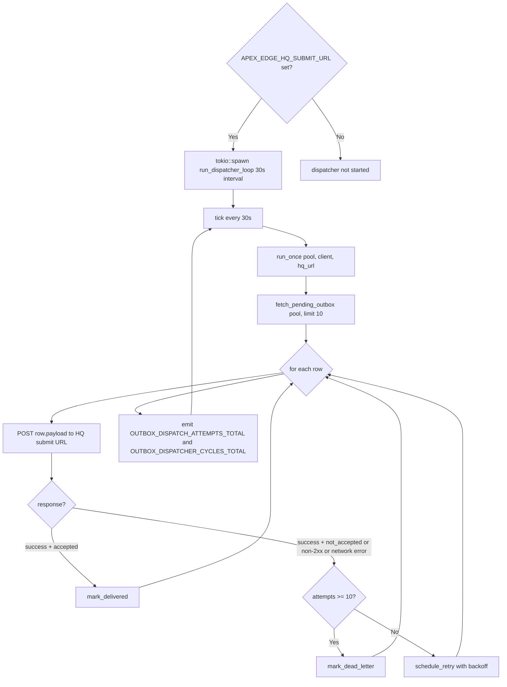
```mermaid
flowchart TB
    EnvCheck{APEX_EDGE_HQ_SUBMIT_URL set?} -->|Yes| SpawnLoop[tokio::spawn run_dispatcher_loop 30s interval]
    SpawnLoop --> Tick[tick every 30s]
    Tick --> RunOnce[run_once pool, client, hq_url]
    RunOnce --> Fetch[fetch_pending_outbox pool, limit 10]
    Fetch --> Loop{for each row}
    Loop --> POST[POST row.payload to HQ submit URL]
    POST --> Result{response?}
    Result -->|success + accepted| MarkDelivered[mark_delivered]
    Result -->|success + not_accepted or non-2xx or network error| CheckAttempts{attempts >= 10?}
    CheckAttempts -->|Yes| DLQ[mark_dead_letter]
    CheckAttempts -->|No| Retry[schedule_retry with backoff]
    MarkDelivered --> Loop
    Retry --> Loop
    DLQ --> Loop
    Loop --> CountMetrics[emit OUTBOX_DISPATCH_ATTEMPTS_TOTAL and OUTBOX_DISPATCHER_CYCLES_TOTAL]
    CountMetrics --> Tick
    EnvCheck -->|No| Skip[dispatcher not started]
```

**Notes:**
- **Inputs:** `pool`, HTTP `client`, `APEX_EDGE_HQ_SUBMIT_URL` (env); pending rows from `apex_edge_storage::outbox`. Background loop started once at startup.
- **Outputs:** Rows marked delivered when HQ returns `accepted`; retry scheduled with exponential backoff (base 5s, capped at 320s); DLQ when `MAX_ATTEMPTS` (10) reached.
- **Metrics:** `apex_edge_outbox_dispatch_attempts_total{outcome}`, `apex_edge_outbox_dispatch_duration_seconds`, `apex_edge_outbox_dlq_total`, `apex_edge_outbox_dispatcher_cycles_total{outcome}`.
- **Failure path:** Cycle-level errors (storage, network) are logged and counted; loop continues on next tick without stopping the process.

### 7. Frontend Journey HTTP Tracker

**Purpose:** Track every wire-level HTTP attempt from sign-in success until Sale Complete summary, and classify calls as local vs non-local.

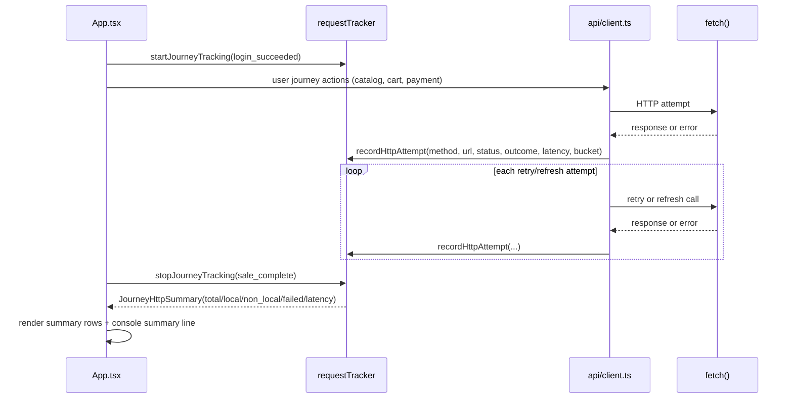
```mermaid
sequenceDiagram
    participant UI as App.tsx
    participant Tracker as requestTracker
    participant API as api/client.ts
    participant Net as fetch()
    UI->>Tracker: startJourneyTracking(login_succeeded)
    UI->>API: user journey actions (catalog, cart, payment)
    API->>Net: HTTP attempt
    Net-->>API: response or error
    API->>Tracker: recordHttpAttempt(method, url, status, outcome, latency, bucket)
    loop each retry/refresh attempt
        API->>Net: retry or refresh call
        Net-->>API: response or error
        API->>Tracker: recordHttpAttempt(...)
    end
    UI->>Tracker: stopJourneyTracking(sale_complete)
    Tracker-->>UI: JourneyHttpSummary(total/local/non_local/failed/latency)
    UI->>UI: render summary rows + console summary line
```

**Notes:**
- **Inputs:** Start trigger is auth session exchange success; each `fetchJson` and `fetchWithAuth` network attempt reports metadata (`method`, `url`, `status`, `outcome`, `latency_ms`, timestamp).
- **Outputs:** Frozen `JourneyHttpSummary` is shown on Sale Complete and emitted to console as a one-line summary.
- **Failure path:** Network errors and non-2xx HTTP statuses are counted as failed requests; retries and token refresh requests are counted as separate wire-level attempts.

### 8. Sync Ingest and Entity Application Flow

**Purpose:** Full sync pipeline: fetch NDJSON from HQ, apply each entity to its storage table, then advance the per-entity checkpoint. All entities supported: catalog, categories, price_book, tax_rules, customers, promotions, coupons, inventory, print_templates. Unknown entities advance checkpoint without storage (forward-compatibility).

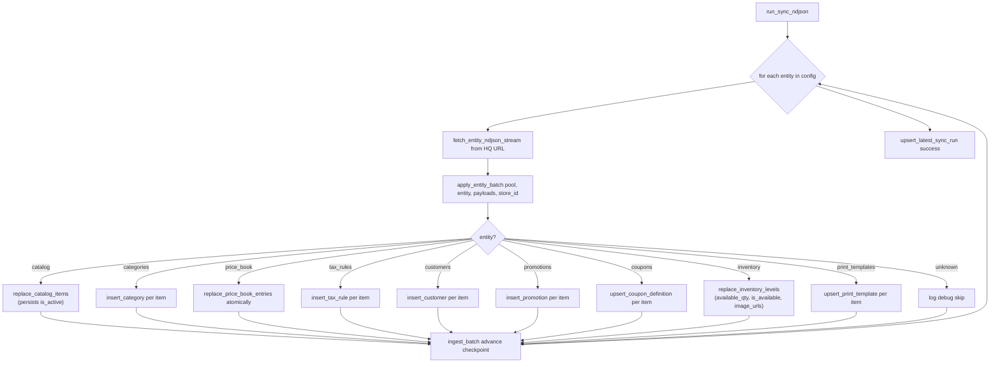
```mermaid
flowchart TB
    RunSync[run_sync_ndjson] --> ForEntity{for each entity in config}
    ForEntity --> Fetch[fetch_entity_ndjson_stream from HQ URL]
    Fetch --> Apply[apply_entity_batch pool, entity, payloads, store_id]
    Apply --> EntitySwitch{entity?}
    EntitySwitch -->|catalog| InsertCatalogItems["replace_catalog_items\n(persists is_active)"]
    EntitySwitch -->|categories| InsertCategory[insert_category per item]
    EntitySwitch -->|price_book| ReplacePriceBook[replace_price_book_entries atomically]
    EntitySwitch -->|tax_rules| InsertTaxRule[insert_tax_rule per item]
    EntitySwitch -->|customers| InsertCustomer[insert_customer per item]
    EntitySwitch -->|promotions| InsertPromotion[insert_promotion per item]
    EntitySwitch -->|coupons| UpsertCoupon[upsert_coupon_definition per item]
    EntitySwitch -->|inventory| ReplaceInventory["replace_inventory_levels\n(available_qty, is_available, image_urls)"]
    EntitySwitch -->|print_templates| UpsertPrintTemplate[upsert_print_template per item]
    EntitySwitch -->|unknown| SkipLog[log debug skip]
    InsertCatalogItems --> Ingest[ingest_batch advance checkpoint]
    InsertCategory --> Ingest
    ReplacePriceBook --> Ingest
    InsertTaxRule --> Ingest
    InsertCustomer --> Ingest
    InsertPromotion --> Ingest
    UpsertCoupon --> Ingest
    ReplaceInventory --> Ingest
    UpsertPrintTemplate --> Ingest
    SkipLog --> Ingest
    Ingest --> ForEntity
    ForEntity --> UpdateStatus[upsert_latest_sync_run success]
```

**Notes:**
- **Inputs:** `pool`, `SyncSourceConfig` (base URL + entity paths), `ContractVersion`, `store_id`. Contract types: `CatalogItem`, `Category`, `PriceBook`, `TaxRule`, `Customer`, `Promotion`, `CouponDefinition`, `InventoryLevel`, `PrintTemplateConfig`.
- **Outputs:** Each entity's data persisted to its storage table; checkpoint advanced per entity; sync run status updated.
- **Metrics:** `apex_edge_sync_ingest_batches_total{entity, outcome}`, `apex_edge_sync_ingest_duration_seconds{entity}`.
- **Failure path:** Invalid JSON payload fails the entity's batch with `IngestError::InvalidPayload`; the whole sync run is marked `failed`; checkpoint does not advance for failed entities; next run retries.
- **price_book:** Synced with delete-and-replace semantics (atomically replaces all price book entries for the store in a transaction).
- **inventory:** Updates `available_qty`, `is_available`, and `image_urls` on existing `catalog_items` rows. Missing item IDs are silently skipped (forward-compatible). Default `available_qty = NULL` means untracked — no stock constraint applied.

### 9. Observability and Behavior Ownership

**Purpose:** Map behavior names and crate/module ownership for metrics and health; transparency for documentation.

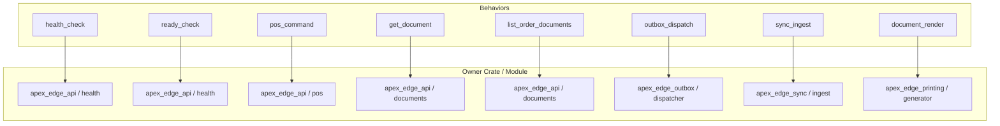
```mermaid
flowchart TB
    subgraph behaviors [Behaviors]
        B1[health_check]
        B2[ready_check]
        B3[pos_command]
        B4[get_document]
        B5[list_order_documents]
        B6[outbox_dispatch]
        B7[sync_ingest]
        B8[document_render]
    end
    subgraph owners [Owner Crate / Module]
        O1[apex_edge_api / health]
        O2[apex_edge_api / health]
        O3[apex_edge_api / pos]
        O4[apex_edge_api / documents]
        O5[apex_edge_api / documents]
        O6[apex_edge_outbox / dispatcher]
        O7[apex_edge_sync / ingest]
        O8[apex_edge_printing / generator]
    end
    B1 --> O1
    B2 --> O2
    B3 --> O3
    B4 --> O4
    B5 --> O5
    B6 --> O6
    B7 --> O7
    B8 --> O8
```

**Notes:**
- **Inputs:** Route or flow from this section's behavior map; health/ready = liveness/readiness; `/metrics` = Prometheus scrape when metrics handle present.
- **Outputs:** Each behavior is the unit of ownership for metrics and tracing; DB probe only in ready_check; document fetch/list via storage; outbox and sync via their crates.
- **Transparency:** This architecture document is the source of truth for route -> behavior -> owner mapping and behavior tiering.
- **Recorder version contract:** every crate must depend on the same `metrics` major as
  `metrics-exporter-prometheus`. The macros write to a global recorder that is per-major, so a
  version skew silently sends every measurement to a recorder nothing exports — `/metrics` stays
  empty while the dashboards look plausible. `apex-edge/tests/metrics_emission.rs` drives the real
  router through the real recorder and asserts the exported families, which is what makes the skew
  a failing test rather than a silent hole.

### 10. Local POS Simulator Frontend

**Purpose:** Document the local-only POS simulator UI: a POS-style interface with catalog (categories, product search, pagination), customer search (name/email/code/id), cart, checkout, and documents.

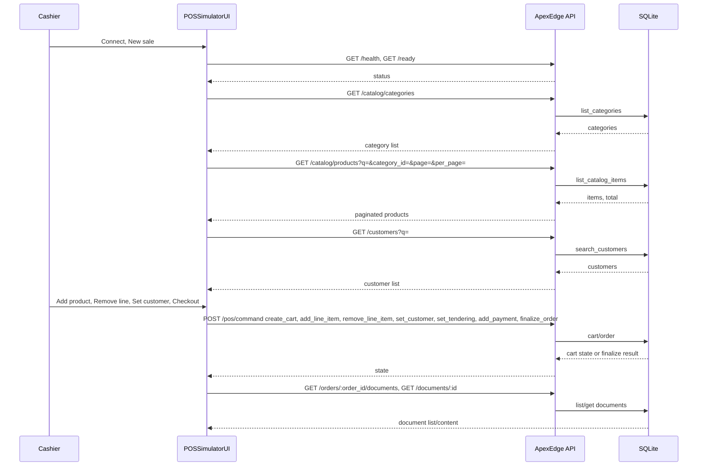
```mermaid
sequenceDiagram
    participant User as Cashier
    participant UI as POSSimulatorUI
    participant API as ApexEdge API
    participant Storage as SQLite
    User->>UI: Connect, New sale
    UI->>API: GET /health, GET /ready
    API-->>UI: status
    UI->>API: GET /catalog/categories
    API->>Storage: list_categories
    Storage-->>API: categories
    API-->>UI: category list
    UI->>API: GET /catalog/products?q=&category_id=&page=&per_page=
    API->>Storage: list_catalog_items
    Storage-->>API: items, total
    API-->>UI: paginated products
    UI->>API: GET /customers?q=
    API->>Storage: search_customers
    Storage-->>API: customers
    API-->>UI: customer list
    User->>UI: Add product, Remove line, Set customer, Checkout
    UI->>API: POST /pos/command create_cart, add_line_item, remove_line_item, set_customer, set_tendering, add_payment, finalize_order
    API->>Storage: cart/order
    Storage-->>API: cart state or finalize result
    API-->>UI: state
    UI->>API: GET /orders/:order_id/documents, GET /documents/:id
    API->>Storage: list/get documents
    Storage-->>UI: document list/content
```

**Notes:**
- **Inputs:** Backend base URL; catalog filters (search q, category, page); customer search q (name, email, code, or id); cart actions and checkout.
- **Outputs:** Categories and paginated product list; customer search results; cart state and finalize result; document list and content.
- **API:** `GET /catalog/categories`, `GET /catalog/products?q=&category_id=&page=&per_page=`, `GET /customers?q=` (and legacy `?code=` for exact code). Products support search by SKU, name, or description; customers by code, name, email, or id.
- **POS commands:** `create_cart`, `add_line_item` (optional `unit_price_override_cents` for positive price override), `update_line_item`, `remove_line_item` (removes a line by `line_id`; re-runs pricing pipeline on remaining lines; transitions cart back to Open when last line is removed), `set_customer`, `apply_promo`, `remove_promo`, `apply_coupon`, `remove_coupon`, `apply_manual_discount` (reason mandatory; kinds: percent_cart, percent_item, fixed_cart, fixed_item), `set_tendering`, `add_payment`, `void_cart`, `finalize_order`. Promotions (automatic + manually applied) and coupons are applied in pipeline; manual discounts are applied after promos and included in order metadata to HQ.
- **Customer on cart:** When `set_customer` succeeds, the API handler looks up the customer record and populates `customer_name` and `customer_code` in `CartState`. Every subsequent command that returns `CartState` also enriches these fields. The cart panel shows a banner with the customer name and code whenever a customer is attached.
- **Layout:** Mobile-first, app-like UI: fixed bottom tab bar (Customers / Catalog / Sync / Cart) with safe-area insets; 44px minimum touch targets; full viewport height (`100dvh`). At 768px+ nav moves to header; at 1024px (e.g. iPad landscape) content is constrained with larger catalog grid. Event log shown from 768px only.
- **Scope:** Simulator runs as a separate dev server (e.g. Vite on port 5173); CORS enabled. Local use only.
- **Product Detail Page:** Clicking "View" on any catalog card navigates to `/product/:id` (URL route). PDP fetches full product via `GET /catalog/products/:id`, displays image gallery (thumbnail strip + main image), availability badge, quantity stepper, and "Add to Cart" button. After add-to-cart, navigates back to `/catalog`. Add-to-cart is disabled when item is inactive or out of stock.
- **Availability in catalog:** Product cards show availability badge (Out of Stock / low stock / In Stock / Available). The "+ Add" button is disabled for out-of-stock or inactive items. Images (first thumbnail) shown when synced.

### 11. Example Sync Source and Streamed Sync

**Purpose:** Document the separate example-sync-source tool and how ApexEdge pulls sync data on startup and periodically via NDJSON streaming; sync status is persisted and exposed to the frontend.

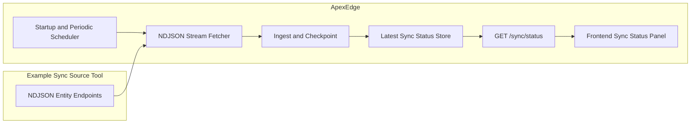
```mermaid
flowchart LR
    subgraph sourceTool [Example Sync Source Tool]
        NDJSON[NDJSON Entity Endpoints]
    end
    subgraph edgeApp [ApexEdge]
        Scheduler[Startup and Periodic Scheduler]
        Fetcher[NDJSON Stream Fetcher]
        Ingest[Ingest and Checkpoint]
        StatusStore[Latest Sync Status Store]
        StatusAPI[GET /sync/status]
        UI[Frontend Sync Status Panel]
    end
    Scheduler --> Fetcher
    Fetcher --> Ingest
    Ingest --> StatusStore
    StatusStore --> StatusAPI
    StatusAPI --> UI
    NDJSON --> Fetcher
```

**Notes:**
- **Example sync source:** Separate binary `tools/example-sync-source`; serves NDJSON per entity (first line `{"total": N}`, then N lines of base64 payload). Contract-only coupling; no app runtime dependencies. Run with `cargo run -p example-sync-source` (default port 3030; `SYNC_SOURCE_PORT` env). Entities: catalog, categories, price_book, tax_rules, promotions, customers, coupons, **inventory** (per-item availability + image URLs).
- **ApexEdge sync:** When `APEX_EDGE_SYNC_SOURCE_URL` is set, main runs sync once on startup then spawns a periodic task controlled by `APEX_EDGE_SYNC_INTERVAL_SECONDS` (default 300s). `inventory` is scheduled before optional entities (`coupons`, `print_templates`) so stock refresh is not delayed by optional-entity failures. `run_sync_ndjson` streams each entity (line-by-line), collects payloads per entity, ingests in batch, advances checkpoints, and updates latest sync run + per-entity status in storage.
- **Sync status:** Stored in `sync_run` (single row) and `entity_sync_status`; exposed at `GET /sync/status`. Frontend Sync tab shows last sync time, run state (idle/syncing), and per-entity progress (current, total, percent, status).
- **Failure path:** Sync errors are logged; latest run is marked `failed` with error message; next scheduled run proceeds on the configured interval.

### 12. Stock and Availability Sync

**Purpose:** Document how inventory levels and product availability are synced from HQ and enforced on the POS add-to-cart path and exposed in the product catalog API.

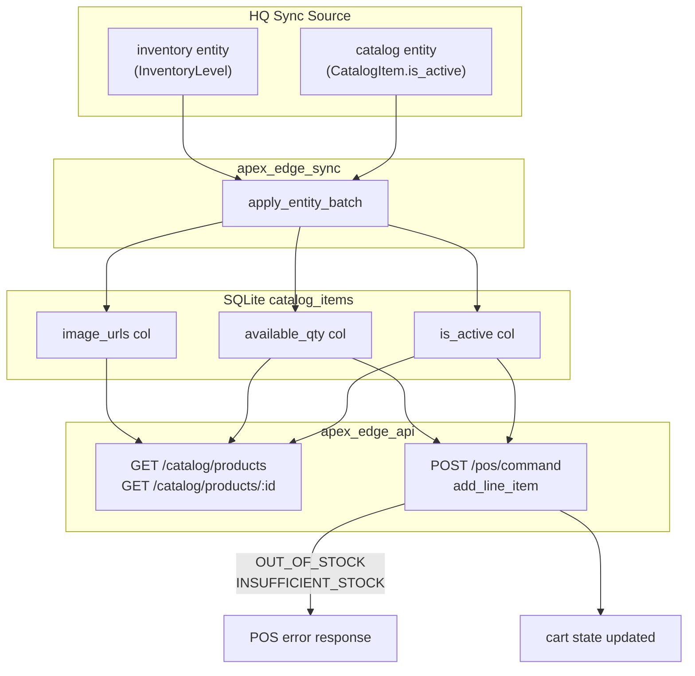
```mermaid
flowchart TB
    subgraph hq [HQ Sync Source]
        CatalogEnt["catalog entity\n(CatalogItem.is_active)"]
        InventoryEnt["inventory entity\n(InventoryLevel)"]
    end
    subgraph sync [apex_edge_sync]
        ApplyBatch[apply_entity_batch]
    end
    subgraph storage [SQLite catalog_items]
        IsActive[is_active col]
        AvailQty[available_qty col]
        ImgUrls[image_urls col]
    end
    subgraph api [apex_edge_api]
        ProductSearch["GET /catalog/products\nGET /catalog/products/:id"]
        AddLine["POST /pos/command\nadd_line_item"]
    end
    CatalogEnt --> ApplyBatch
    InventoryEnt --> ApplyBatch
    ApplyBatch --> IsActive
    ApplyBatch --> AvailQty
    ApplyBatch --> ImgUrls
    IsActive --> ProductSearch
    AvailQty --> ProductSearch
    ImgUrls --> ProductSearch
    IsActive --> AddLine
    AvailQty --> AddLine
    AddLine -->|"OUT_OF_STOCK\nINSUFFICIENT_STOCK"| StockError[POS error response]
    AddLine --> CartState[cart state updated]
```

**Notes:**
- **Inputs:** `catalog` sync entity persists `is_active` from `CatalogItem`. `inventory` sync entity persists `available_qty`, `is_available`, and `image_urls` from `InventoryLevel` (per-item, per-store).
- **Outputs:** `ProductSearchResult` now includes `is_active`, `available_qty` (nullable — `null` = untracked), and `image_urls`. `GET /catalog/products/:id` returns full product detail for PDP.
- **Stock enforcement:** `add_line_item` checks `CatalogItemRow::check_quantity` before inserting a line. Returns `OUT_OF_STOCK` if `is_active=false` or `available_qty <= 0`; returns `INSUFFICIENT_STOCK` if `quantity > available_qty`. Items with `available_qty = NULL` (inventory not yet synced) are not constrained.
- **Metrics:** `apex_edge_catalog_stock_checks_total{outcome}` counts add-to-cart stock checks (ok, OUT_OF_STOCK, INSUFFICIENT_STOCK). `apex_edge_catalog_product_by_id_total{outcome}` counts product-by-id requests.
- **Failure path:** HQ may not have inventory synced for all items — defaults to NULL (untracked), which never blocks cart. is_active defaults to 1 (active).

### 13. Product Detail Page (PDP) with Image Gallery

**Purpose:** Document the URL-routed Product Detail Page in the POS simulator frontend; image gallery, quantity stepper, availability badge, and add-to-cart flow.

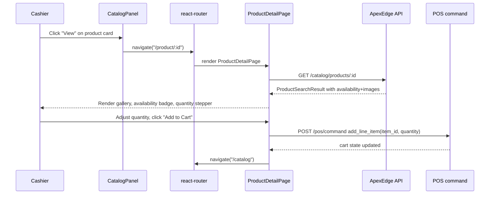
```mermaid
sequenceDiagram
    participant Cashier as Cashier
    participant CatalogUI as CatalogPanel
    participant Router as react-router
    participant PDP as ProductDetailPage
    participant API as ApexEdge API
    participant POS as POS command
    Cashier->>CatalogUI: Click "View" on product card
    CatalogUI->>Router: navigate("/product/:id")
    Router->>PDP: render ProductDetailPage
    PDP->>API: GET /catalog/products/:id
    API-->>PDP: ProductSearchResult with availability+images
    PDP-->>Cashier: Render gallery, availability badge, quantity stepper
    Cashier->>PDP: Adjust quantity, click "Add to Cart"
    PDP->>POS: POST /pos/command add_line_item(item_id, quantity)
    POS-->>PDP: cart state updated
    PDP->>Router: navigate("/catalog")
```

**Notes:**
- **Inputs:** URL parameter `:id` (product UUID). Backend `GET /catalog/products/:id` returns full `ProductSearchResult` including `available_qty`, `is_active`, and `image_urls`.
- **Outputs:** PDP displays product name, SKU, description, availability badge (Out of Stock / low stock / In Stock / Available-untracked), image gallery with thumbnail strip, quantity stepper, and Add to Cart button.
- **Routing:** PDP is at `/product/:id`. CatalogPanel "View" button navigates there. PDP Back button and post-add-to-cart both navigate to `/catalog`. Main POS app continues at `/*` routes.
- **Availability enforcement:** "Add to Cart" button is disabled when `is_active=false` or `available_qty <= 0`. Quantity stepper is capped at `available_qty` when tracked.
- **Image gallery:** Thumbnail strip shows all `image_urls`; clicking a thumbnail swaps the main image. Keyboard-accessible. Falls back to placeholder icon when no images are synced.

### 14. Internal Security Baseline (CORS)

**Purpose:** Document the configurable CORS posture introduced for the v0.1.0 internal-alpha security baseline. By default the hub allows all origins (suitable for local dev); a comma-separated env var locks CORS to an explicit allowlist in controlled deployments.

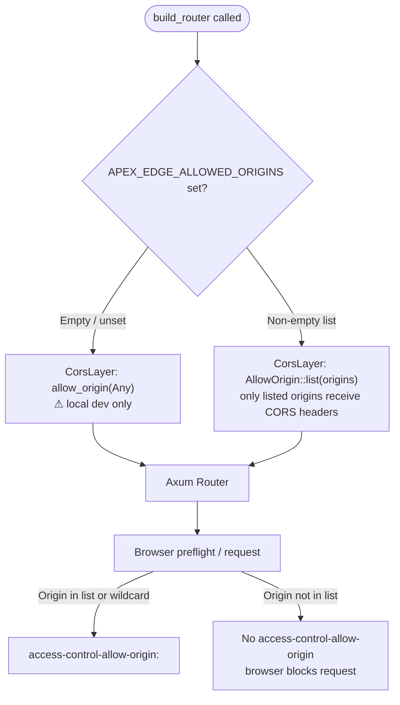
```mermaid
flowchart TD
    Start([build_router called]) --> CheckOrigins{APEX_EDGE_ALLOWED_ORIGINS set?}
    CheckOrigins -->|Empty / unset| Wildcard["CorsLayer: allow_origin(Any)\n⚠ local dev only"]
    CheckOrigins -->|Non-empty list| Restricted["CorsLayer: AllowOrigin::list(origins)\nonly listed origins receive CORS headers"]
    Wildcard --> Router[Axum Router]
    Restricted --> Router
    Router --> Browser[Browser preflight / request]
    Browser -->|Origin in list or wildcard| ACAO["access-control-allow-origin: <origin>"]
    Browser -->|Origin not in list| NoHeader["No access-control-allow-origin\nbrowser blocks request"]
```

**Notes:**
- **Inputs:** Env `APEX_EDGE_ALLOWED_ORIGINS` — comma-separated list of allowed origins (e.g. `http://localhost:5173,https://pos.example.internal`). Unset or empty = wildcard (logs a warning).
- **Outputs:** `access-control-allow-origin` header on preflight and actual responses; restricted list means unknown origins receive no matching header and browsers enforce the block.
- **Failure path:** Malformed origin strings (not valid `HeaderValue`) are silently skipped; if all entries are invalid the fallback is wildcard with a warning.
- **Tests:** `cors_restricted_trusted_origin_is_allowed` and `cors_restricted_unknown_origin_is_rejected` in `apex-edge/tests/cors_http.rs` verify both branches.

### 15. Synced PDF Receipt Templates

**Purpose:** Document how receipt and gift-receipt documents are produced from synced HTML templates, rendered with cart/order data, and output as PDFs for the POS to open or print.

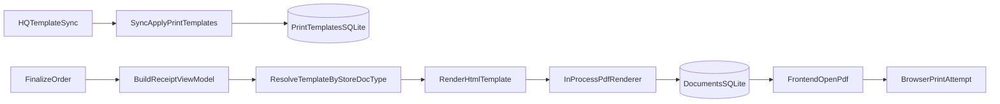
```mermaid
flowchart LR
    HqTemplates[HQTemplateSync] --> SyncApply[SyncApplyPrintTemplates]
    SyncApply --> TemplateStore[(PrintTemplatesSQLite)]
    FinalizeOrder[FinalizeOrder] --> ReceiptVm[BuildReceiptViewModel]
    ReceiptVm --> TemplateResolve[ResolveTemplateByStoreDocType]
    TemplateResolve --> HtmlRender[RenderHtmlTemplate]
    HtmlRender --> PdfEngine[InProcessPdfRenderer]
    PdfEngine --> Documents[(DocumentsSQLite)]
    Documents --> FrontendOpen[FrontendOpenPdf]
    FrontendOpen --> BrowserPrint[BrowserPrintAttempt]
```

**Notes:**
- **Inputs:** Sync entity `print_templates` with payloads `PrintTemplateConfig` (id, document_type, template_body, version); store_id from sync context. Finalize/gift-receipt use receipt view-model (order_id, store/customer/totals/lines/payments, tenant, logo placeholder).
- **Outputs:** Documents table row with `mime_type application/pdf` and base64-encoded PDF in `content`; frontend opens via Blob URL and attempts print.
- **Template engine:** `{{key}}` substitution and `{{#each key}}...{{/each}}` for arrays; HTML template is rendered to a deterministic in-process PDF stream (no external browser startup).
- **Failure path:** Missing template falls back to plain-text receipt. Template render error or PDF engine failure marks document as failed and is recorded in `apex_edge_document_render_total{outcome=template_error|pdf_error}`.
- **Metrics:** `apex_edge_document_render_total{document_type, outcome}`, `apex_edge_document_render_duration_seconds{document_type}`. Sync of `print_templates` is covered by `apex_edge_sync_ingest_batches_total{entity=print_templates}`.

### 16. Edge Auth and Device Trust

**Purpose:** Document local hub authentication so mPOS clients can pair once, then exchange external associate identity tokens for hub sessions used to call protected northbound routes.

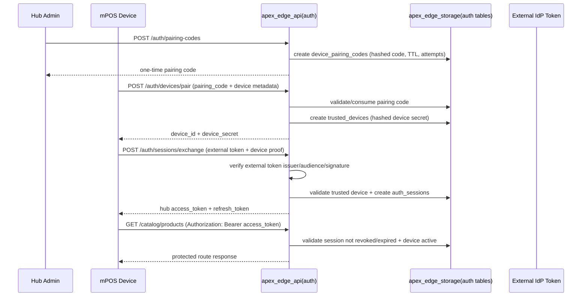
```mermaid
sequenceDiagram
    participant Admin as Hub Admin
    participant POS as mPOS Device
    participant API as apex_edge_api(auth)
    participant Store as apex_edge_storage(auth tables)
    participant Ext as External IdP Token

    Admin->>API: POST /auth/pairing-codes
    API->>Store: create device_pairing_codes (hashed code, TTL, attempts)
    API-->>Admin: one-time pairing code

    POS->>API: POST /auth/devices/pair (pairing_code + device metadata)
    API->>Store: validate/consume pairing code
    API->>Store: create trusted_devices (hashed device secret)
    API-->>POS: device_id + device_secret

    POS->>API: POST /auth/sessions/exchange (external token + device proof)
    API->>API: verify external token issuer/audience/signature
    API->>Store: validate trusted device + create auth_sessions
    API-->>POS: hub access_token + refresh_token

    POS->>API: GET /catalog/products (Authorization: Bearer access_token)
    API->>Store: validate session not revoked/expired + device active
    API-->>POS: protected route response
```

**Notes:**
- **Inputs:** Pairing requests (`store_id`, `created_by`), device metadata (`device_name`, optional `platform`), external associate token (`iss`, `aud`, `sub`, `store_id` claims), and bearer session tokens on protected routes.
- **Outputs:** `trusted_devices`, `device_pairing_codes`, `auth_sessions`, and `associate_identities` persisted locally. Protected routes return `401` when session/device validation fails.
- **Protection scope:** `/pos/*`, `/catalog/*`, `/customers`, `/documents/*`, `/orders/*`, `/sync/status` are protected. Auth is **enabled by default** (`APEX_EDGE_AUTH_ENABLED` opts out) as of v2.0.0 — see [§42](#42-hub-identity-tlsmtls-and-rate-limiting-v200). `/health`, `/ready`, and auth bootstrap/session endpoints remain callable as designed. Third-party API tokens (§30) are additionally scope-checked per route by `required_scope_for_path`/`token_scopes_allow` — a token missing the route's required scope gets `403`, not just `401` for a missing token.
- **Failure path:** Invalid/expired/consumed pairing code, device mismatch, token validation failure, and revoked/expired sessions all fail closed with `401`/`400`; attempts are tracked on pairing codes.
- **Metrics:** `apex_edge_auth_requests_total{operation,outcome}`, `apex_edge_auth_request_duration_seconds{operation}`, `apex_edge_auth_sessions_total{outcome}`, `apex_edge_device_pairings_total{outcome}`.

### 17. MPOS Local Normal Sale (Login Cloud, Sale Local)

**Purpose:** Show the normal-sale local mode where login stays cloud-side and all sale runtime requests (catalog, customer, cart, promotions/coupons, cash payment, place order) execute on local ApexEdge.

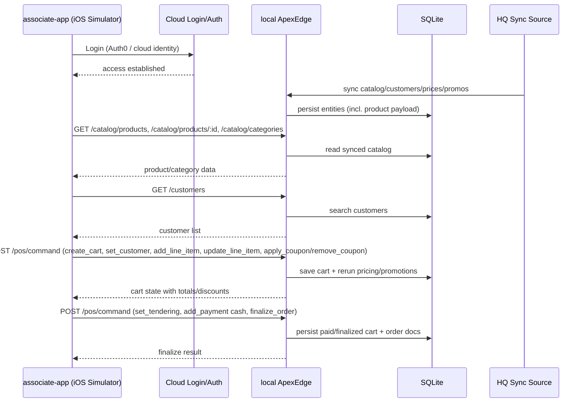
```mermaid
sequenceDiagram
    participant MPOS as associate-app (iOS Simulator)
    participant Cloud as Cloud Login/Auth
    participant Hub as local ApexEdge
    participant DB as SQLite
    participant HQ as HQ Sync Source

    MPOS->>Cloud: Login (Auth0 / cloud identity)
    Cloud-->>MPOS: access established

    HQ->>Hub: sync catalog/customers/prices/promos
    Hub->>DB: persist entities (incl. product payload)

    MPOS->>Hub: GET /catalog/products, /catalog/products/:id, /catalog/categories
    Hub->>DB: read synced catalog
    Hub-->>MPOS: product/category data

    MPOS->>Hub: GET /customers
    Hub->>DB: search customers
    Hub-->>MPOS: customer list

    MPOS->>Hub: POST /pos/command (create_cart, set_customer, add_line_item, update_line_item, apply_coupon/remove_coupon)
    Hub->>DB: save cart + rerun pricing/promotions
    Hub-->>MPOS: cart state with totals/discounts

    MPOS->>Hub: POST /pos/command (set_tendering, add_payment cash, finalize_order)
    Hub->>DB: persist paid/finalized cart + order docs
    Hub-->>MPOS: finalize result
```

**Notes:**
- **Inputs:** Cloud login result, synced entities from HQ, and local sale commands from MPOS.
- **Outputs:** All normal-sale state transitions and cart totals are produced by local ApexEdge endpoints; no post-login cloud dependency is required for the normal-sale path.
- **Failure path:** Missing catalog/customer/cart or invalid coupon/payment returns command errors (`success=false`) from `/pos/command`; MPOS local-hub mode handles these as sale-flow errors.

### 18. Documents API Canonical Types

**Purpose:** Keep northbound documents contract strict for POS integrations by returning canonical document type values in both `type` and `document_type`.

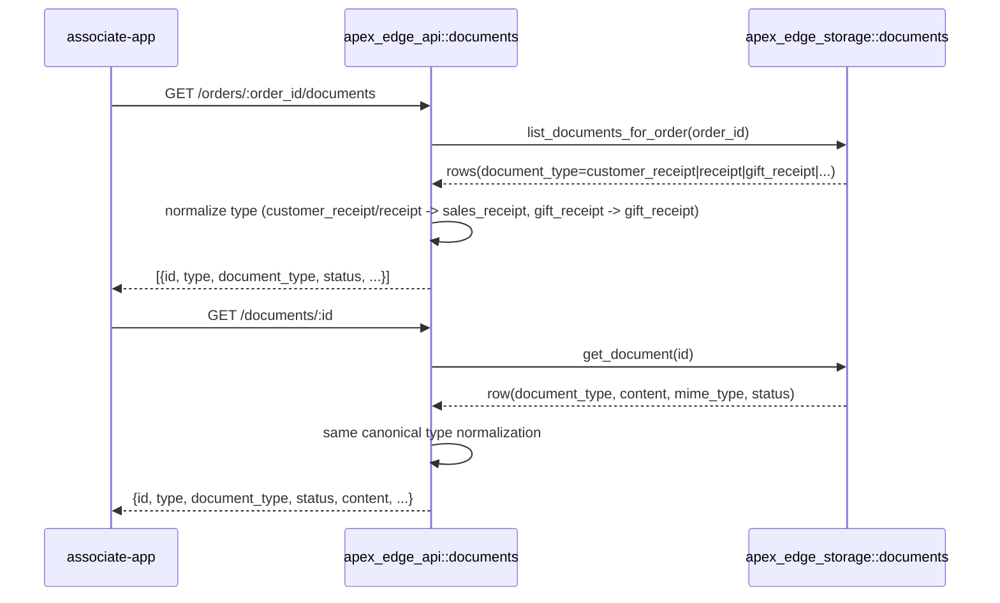
```mermaid
sequenceDiagram
    participant MPOS as associate-app
    participant API as apex_edge_api::documents
    participant DB as apex_edge_storage::documents

    MPOS->>API: GET /orders/:order_id/documents
    API->>DB: list_documents_for_order(order_id)
    DB-->>API: rows(document_type=customer_receipt|receipt|gift_receipt|...)
    API->>API: normalize type (customer_receipt/receipt -> sales_receipt, gift_receipt -> gift_receipt)
    API-->>MPOS: [{id, type, document_type, status, ...}]

    MPOS->>API: GET /documents/:id
    API->>DB: get_document(id)
    DB-->>API: row(document_type, content, mime_type, status)
    API->>API: same canonical type normalization
    API-->>MPOS: {id, type, document_type, status, content, ...}
```

**Notes:**
- **Inputs:** Existing document rows with internal `document_type`.
- **Outputs:** `type` and `document_type` are both canonical northbound values (`sales_receipt`, `gift_receipt`, or passthrough unknown types).
- **Failure path:** Unknown document types are passed through unchanged; storage failures still return existing HTTP `500/404` behavior.

### 19. Synced Product Image Fallbacks for Frontend

**Purpose:** Ensure synced catalog products always provide frontend-ready image URLs by resolving inventory images first, then catalog images, and finally a deterministic placeholder.

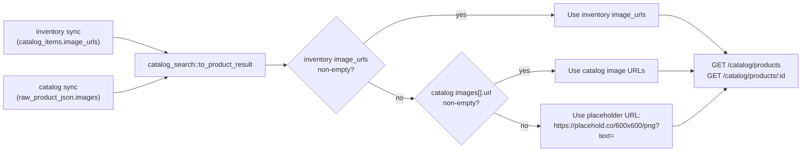
```mermaid
flowchart LR
    Inventory["inventory sync\n(catalog_items.image_urls)"] --> Resolve["catalog_search::to_product_result"]
    Catalog["catalog sync\n(raw_product_json.images)"] --> Resolve
    Resolve --> HasInv{"inventory image_urls\nnon-empty?"}
    HasInv -->|yes| UseInv["Use inventory image_urls"]
    HasInv -->|no| HasCatalog{"catalog images[].url\nnon-empty?"}
    HasCatalog -->|yes| UseCatalog["Use catalog image URLs"]
    HasCatalog -->|no| UsePlaceholder["Use placeholder URL:\nhttps://placehold.co/600x600/png?text=<sku|name>"]
    UseInv --> API["GET /catalog/products\nGET /catalog/products/:id"]
    UseCatalog --> API
    UsePlaceholder --> API
```

**Notes:**
- **Inputs:** Synced `inventory.image_urls`, synced `catalog.images`, and product `sku`/`name` for placeholder text fallback.
- **Outputs:** `ProductSearchResult.image_urls` is always populated, so frontend catalog cards and PDP can render without missing-image branching.
- **Resolution order:** inventory images take precedence over catalog images (store-level override), then placeholder.
- **Metrics:** `apex_edge_catalog_product_image_selection_total{source=inventory|catalog|placeholder}` records the selected source for observability.
- **Failure path:** When both sync sources omit images, the API still returns a placeholder URL instead of an empty array.

### 20. Local Observability Stack (Prometheus + Grafana)

**Purpose:** Provide a local monitoring stack for Edge operators to inspect live metrics, dependency health, and transaction journey behavior with no manual dashboard setup.

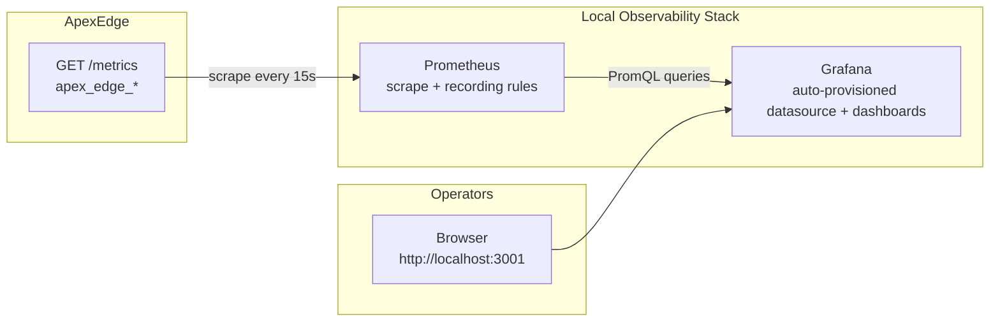
```mermaid
flowchart LR
    subgraph edge [ApexEdge]
        Metrics["GET /metrics\napex_edge_*"]
    end
    subgraph obs [Local Observability Stack]
        Prom["Prometheus\nscrape + recording rules"]
        Graf["Grafana\nauto-provisioned datasource + dashboards"]
    end
    subgraph users [Operators]
        Browser["Browser\nhttp://localhost:3001"]
    end
    Metrics -->|"scrape every 15s"| Prom
    Prom -->|"PromQL queries"| Graf
    Browser --> Graf
```

**Notes:**
- **Inputs:** ApexEdge metrics endpoint (`http://host.docker.internal:3000/metrics`) scraped by Prometheus; recording rules compute traffic/error/latency and transaction funnel aggregates.
- **Outputs:** Three provisioned dashboards: **Edge System Health**, **Dependencies & Data Flows**, and **Transaction Journey**.
- **Failure path:** If ApexEdge is not reachable, Prometheus target state shows `DOWN`; Grafana dashboards render `No data` rather than stale metrics.
- **Behavior map and ownership:** The observability stack dashboards and alerts use these behavior-level owners and primary metric families.

| Behavior | Entry point | Owner crate/module | Primary metrics |
|---|---|---|---|
| `health_check` | `GET /health` | `apex_edge_api::health` | `apex_edge_http_requests_total`, `apex_edge_http_request_duration_seconds` |
| `ready_check` | `GET /ready` | `apex_edge_api::health` | `apex_edge_http_requests_total`, `apex_edge_http_request_duration_seconds` |
| `pos_command` | `POST /pos/command` | `apex_edge_api::pos` | `apex_edge_pos_commands_total`, `apex_edge_pos_command_duration_seconds` |
| `get_document` | `GET /documents/:id` | `apex_edge_api::documents` | `apex_edge_document_operations_total`, `apex_edge_document_operation_duration_seconds` |
| `list_order_documents` | `GET /orders/:order_id/documents` | `apex_edge_api::documents` | `apex_edge_document_operations_total`, `apex_edge_document_operation_duration_seconds` |
| `outbox_dispatch` | background loop | `apex_edge_outbox::dispatcher` | `apex_edge_outbox_dispatch_attempts_total`, `apex_edge_outbox_dispatch_duration_seconds`, `apex_edge_outbox_dlq_total`, `apex_edge_outbox_dispatcher_cycles_total` |
| `sync_ingest` | sync scheduler + ingest | `apex_edge_sync::ingest` | `apex_edge_sync_ingest_batches_total`, `apex_edge_sync_ingest_duration_seconds` |
| `db_operations` | storage layer | `apex_edge_storage::*` | `apex_edge_db_operations_total`, `apex_edge_db_operation_duration_seconds` |
| `auth_flows` | `/auth/*` routes | `apex_edge_api::auth` | `apex_edge_auth_requests_total`, `apex_edge_auth_request_duration_seconds`, `apex_edge_auth_sessions_total`, `apex_edge_device_pairings_total` |
| `document_render` | order document generation | `apex_edge_printing::generator` | `apex_edge_document_render_total`, `apex_edge_document_render_duration_seconds` |

- **Tiering:** Use these tiers to prioritize implementation and operational response.

| Tier | Meaning |
|---|---|
| Tier 1 | User-path critical: transaction and checkout behavior (`pos_command`) |
| Tier 2 | Dependency health: DB and outbound integration (`db_operations`, `outbox_dispatch`) |
| Tier 3 | Data freshness: sync ingest and related entity outcomes (`sync_ingest`) |
| Tier 4 | Supportability: auth and document retrieval/rendering (`auth_flows`, `get_document`, `list_order_documents`, `document_render`) |
| Tier 5 | Platform baselines: liveness/readiness route-level telemetry (`health_check`, `ready_check`) |

### 21. Checkout Command Completion (v0.5.0)

**Purpose:** Document the completed cart command set for retail checkout: idempotent POS command handling, explicit promo lifecycle (`apply_promo`, `remove_promo`), coupon definition validation, and cart voiding (`void_cart`).

```mermaid
flowchart TD
    PosClient[POSClient] -->|"POST /pos/command"| VersionGate
    VersionGate -->|unsupported| UnsupportedVersion[UNSUPPORTED_VERSION]
    VersionGate -->|supported| IdempotencyCheck[Check idempotency table]
    IdempotencyCheck -->|replay| ReplayResponse[Return stored response]
    IdempotencyCheck -->|new key| Dispatch[execute_pos_command]

    Dispatch -->|apply_promo| ApplyPromoCmd[Validate promo_id and rerun pricing]
    Dispatch -->|remove_promo| RemovePromoCmd[Remove promo_id and rerun pricing]
    Dispatch -->|apply_coupon| ApplyCouponCmd[Load coupon_definition and validate eligibility]
    Dispatch -->|void_cart| VoidCartCmd[Clear mutable cart state and set Voided]
    Dispatch -->|other commands| ExistingFlow[Existing command handlers]

    ApplyCouponCmd --> CouponDefs[(coupon_definitions table)]
    ApplyPromoCmd --> Promotions[(promotions table)]
    RemovePromoCmd --> Promotions

    ApplyPromoCmd --> PersistCart[save_cart]
    RemovePromoCmd --> PersistCart
    ApplyCouponCmd --> PersistCart
    VoidCartCmd --> PersistCart
    ExistingFlow --> PersistCart

    PersistCart --> BuildCartState[build_cart_state with customer_name/customer_code]
    BuildCartState --> StoreIdem[Persist response by idempotency key]
    StoreIdem --> PosClient
```

**Notes:**
- **Inputs:** `PosRequestEnvelope` with `idempotency_key`; synced `promotions` and `coupon_definitions`; cart state in `carts`.
- **Outputs:** Deterministic replay for repeated idempotency keys, explicit promo/coupon command outcomes, and `CartState` enriched with `customer_name` and `customer_code`.
- **Failure path:** Unknown/invalid promo or coupon returns `success=false` with domain error (`PROMO_NOT_FOUND`, `COUPON_NOT_FOUND`, `INVALID_COUPON`, `INVALID_STATE`) without partial mutation.
- **Metrics:** Existing POS command counters/histograms continue to track these command paths (`apex_edge_pos_commands_total`, `apex_edge_pos_command_duration_seconds`).

### 22. Fake HQ for Local OMS Demos

**Purpose:** Provide a local HQ replacement for demos and integration testing that accepts outbox order submissions, persists them in SQLite, serves sync NDJSON endpoints, and exposes OMS-style listing/detail pages.

```mermaid
sequenceDiagram
    participant POS as POS_MPOS
    participant Edge as ApexEdge
    participant Outbox as OutboxDispatcher
    participant FakeHQ as FakeHQ_Axum
    participant FakeDB as FakeHQ_SQLite

    POS->>Edge: POST /pos/command finalize_order
    Edge->>Outbox: enqueue HqOrderSubmissionEnvelope
    Outbox->>FakeHQ: POST /api/orders
    FakeHQ->>FakeDB: upsert by submission_id
    FakeDB-->>FakeHQ: inserted or duplicate
    FakeHQ-->>Outbox: HqOrderSubmissionResponse accepted=true

    Edge->>FakeHQ: GET /sync/ndjson/:entity?since=0
    FakeHQ-->>Edge: NDJSON stream total + base64 payload lines

    Browser->>FakeHQ: GET /
    FakeHQ-->>Browser: paginated order table
    Browser->>FakeHQ: GET /orders/:submission_id
    FakeHQ-->>Browser: order detail page + API payload
```

**Notes:**
- **Inputs:** `HqOrderSubmissionEnvelope` via `POST /api/orders`, and sync pulls from ApexEdge using `/sync/ndjson/*`.
- **Outputs:** idempotent `HqOrderSubmissionResponse`, paginated `/api/orders` listing, `/api/orders/:submission_id` details, and demo UI pages for OMS workflows.
- **Failure path:** invalid payloads return HTTP `422`; unknown order IDs return `404`; duplicate `submission_id` is treated as accepted idempotent replay.
- **Metrics:** Fake HQ emits local counters/histogram for ingest observability (`fake_hq_orders_received_total`, `fake_hq_orders_duplicate_total`, `fake_hq_order_receive_duration_seconds`).

### 23. Order Ledger and Shift Cash Accounting (v0.7.0)

**Purpose:** Persist finalized sales as durable local order facts, expose read-only order lookup APIs, and compute X/Z report expected cash from ledger sales plus finalized cash refunds.

```mermaid
flowchart TB
    POS[POS_MPOS] -->|"finalize_order"| PosCommand[POST /pos/command]
    PosCommand --> Cart[Cart Aggregate]
    Cart --> Ledger[(orders, order_lines, order_payments)]
    PosCommand --> Outbox[(outbox)]
    PosCommand --> Docs[(documents)]
    Outbox --> HQ[HQ]

    Returns[Returns Flow] --> ReturnTables[(returns and refunds)]
    Ledger --> ShiftMath[Shift Expected Cash]
    ReturnTables --> ShiftMath
    Movements[(shift_movements)] --> ShiftMath
    ShiftMath --> XReport[GetXReport]
    ShiftMath --> ZReport[CloseTill]
    XReport --> POS
    ZReport --> POS
```

**Notes:**
- **Inputs:** paid carts finalized through `FinalizeOrder`, optional open shift for `(store_id, register_id)`, cash payments identified by payment tender metadata, finalized returns/refunds linked by `shift_id`, and drawer movements.
- **Outputs:** `GET /orders` and `GET /orders/:id` read from the local ledger; X/Z reports include `cash_sales_cents`, `cash_refunds_cents`, `expected_cents`, and variance; HQ shift submissions include the same cash sales/refunds totals.
- **Failure path:** order ledger write failure returns `ORDER_LEDGER_FAILED` before outbox/document work; missing order lookup returns 404; shift accounting falls back to zero for unavailable ledger aggregates rather than blocking close.
- **Shift recovery:** `open_till` on a register that already has an open shift fails with `SHIFT_ALREADY_OPEN` and carries that shift in the payload (`{"shift_id": ...}`), so a register that crashed or reloaded mid-shift can resume its own till instead of being locked out.
- **Metrics:** order finalization and lookup use `apex_edge_orders_finalized_total`, `apex_edge_orders_lookup_total`, and `apex_edge_orders_ledger_write_duration_seconds`; HTTP metrics label the order routes explicitly.

### 24. Payment Provider Adapters (v0.8.0)

**Purpose:** Add a pluggable payment-provider boundary for cash and terminal-backed tenders without ApexEdge handling raw card data or EMV kernels.

```mermaid
flowchart TB
    POS[POS_MPOS] -->|"add_payment metadata"| PosCommand[POST /pos/command]
    PosCommand --> CartJson[(Cart JSON)]
    CartJson --> Finalize[finalize_order]
    Finalize --> Ledger[(order_payments)]
    Finalize --> Receipt[Receipt Payload]
    Finalize --> HQ[HQ Submission]

    subgraph paymentAdapters [Payment Adapter Crate]
        Trait[PaymentProvider]
        Cash[CashPaymentProvider]
        Stripe[StripeTerminalProvider]
        Simulated[SimulatedTerminalProvider]
    end

    Trait --> Cash
    Trait --> Stripe
    Trait --> Simulated
    POS --> Trait
```

**Notes:**
- **Inputs:** `AddPaymentPayload` can carry `tip_amount_cents`, `provider`, `provider_payment_id`, and `entry_method` in addition to the existing tender id, amount, and external reference. Adapter calls return opaque provider payment ids and receipt metadata only.
- **Outputs:** Cart payment records, order ledger rows, receipt payloads, and HQ `HqPayment` payloads preserve provider metadata and tip amounts.
- **Failure path:** Unconfigured terminal adapters fail closed with `PaymentProviderError::NotConfigured`; zero-value provider payments fail as `InvalidAmount`. POS `add_payment` errors increment payment attempt metrics with `outcome=error`.
- **Metrics:** `apex_edge_payment_attempts_total{provider,outcome}` and `apex_edge_payment_duration_seconds{provider}` observe the `add_payment` path. Provider implementations are in `crates/adapters/payment`.

### 25. Tax Provider Adapters and Currency Rounding (v0.8.0)

> **Status (v2.1.0):** the `TaxProvider` crate (`crates/adapters/tax`) is not a dependency of the
> hub. Cart tax is computed in `apex-edge-domain` (`tax_for_line`) from synced `TaxRule`s, and
> the `apex_edge_tax_quote_*` metrics are never emitted. The currency-rounding notes below are live.

**Inclusive vs exclusive tax (v2.1.0).** `tax_for_line` reads each synced `TaxRule.inclusive` flag.
An exclusive rule adds tax on top of the discounted price; an inclusive rule (EU VAT) extracts the
tax already inside it (`price − price·10000/(10000+rate)`). Every line carries `tax_inclusive`
from cart to order ledger (`order_lines.tax_inclusive`), HQ payload (`HqOrderLine.tax_inclusive`),
returns (`ReturnLineItemPayload.tax_inclusive`, `return_lines.tax_inclusive`) and fiscal lines, so
all records agree: exclusive gross = price + tax, inclusive gross = price and net = price − tax.
The flag defaults to `false`, so stored data and older clients keep exclusive semantics.

```mermaid
flowchart LR
    Line[line price after discounts] --> Rule{rule.inclusive?}
    Rule -->|no| Excl[tax = price x rate; gross = price + tax]
    Rule -->|yes| Incl[tax = price - price/(1+rate); gross = price; net = price - tax]
    Excl --> Records[cart / order ledger / HQ / fiscal]
    Incl --> Records
```

**Purpose:** Support US/Canada destination-style stacked tax, EU inclusive VAT, and hosted tax providers through a single tax quote boundary.

```mermaid
flowchart TB
    CartPricing[PricingPipeline] --> TaxRequest[TaxQuoteRequest]
    TaxRequest --> TaxProvider[TaxProvider]
    TaxProvider --> Internal[InternalTaxProvider]
    TaxProvider --> Avalara[Avalara]
    TaxProvider --> StripeTax[StripeTax]
    Internal --> Rules[(SyncedTaxRules)]
    TaxProvider --> Quote[TaxQuoteBreakdown]
    Quote --> CartTotals[CartTotals]
    Currency[StoreConfigCurrency] --> Rounding[ISO Minor Unit Rounding]
    Rounding --> CartTotals
```

**Notes:**
- **Inputs:** `TaxQuoteRequest` contains currency, line tax categories, taxable amounts, and optional destination data. Internal tax quotes use synced `TaxRule` rows.
- **Outputs:** `TaxQuote` returns per-line jurisdiction breakdowns with rate, inclusive flag, and total tax cents. Domain pricing exposes ISO-minor-unit rounding for USD/CAD/EUR-style 2-decimal currencies, JPY/KRW-style zero-decimal currencies, and KWD/BHD-style 3-decimal currencies.
- **Failure path:** Hosted `Avalara` and `StripeTax` adapters fail closed with `TaxProviderError::NotConfigured` until credentials are configured; empty quotes return `EmptyQuote`.
- **Metrics:** `apex_edge_tax_quote_total{provider,outcome}` and `apex_edge_tax_quote_duration_seconds{provider}` are reserved for quote paths.

### 26. Hardware Provider Boundary (v0.9.0)

**Purpose:** Own retail-counter hardware through pluggable, sidecar-friendly traits for receipt printing, drawer kick, barcode scanner, scale, and customer-facing display.

```mermaid
flowchart TB
    POS[POS_MPOS] --> HardwareAPI[HardwareAdapterTraits]
    HardwareAPI --> Printer[ReceiptPrinter]
    HardwareAPI --> Drawer[CashDrawer]
    HardwareAPI --> Scanner[BarcodeScanner]
    HardwareAPI --> Scale[WeightScale]
    HardwareAPI --> Display[CustomerDisplay]

    Printer --> EscPos[ESC_POS_USB_TCP]
    Drawer --> EscPos
    Scanner --> HID[HIDScanner]
    Scale --> NCI[NCIScale]
    Display --> TextDisplay[TextCustomerDisplay]
    HardwareAPI --> Sidecar[OptionalOSDriverSidecar]
```

**Notes:**
- **Inputs:** Print requests carry document type and rendered bytes; scanner/scale/display operations use bounded value objects (`BarcodeScan`, `ScaleReading`, display text).
- **Outputs:** Hardware adapters return deterministic success/failure without exposing OS driver details to the core hub. ESC/POS printer and drawer support USB/TCP or an optional sidecar process.
- **Failure path:** Unconfigured devices fail closed with `HardwareError::NotConfigured`; empty print/display payloads fail as `EmptyPayload`.
- **Metrics:** `apex_edge_hardware_operations_total{device,operation,outcome}` and `apex_edge_hardware_operation_duration_seconds{device,operation}` are reserved for hardware command paths.

### 27. Suspended Sales, Register Layouts, and Time Clock (v0.9.0)

**Purpose:** Add day-of-store operations required for real cashdesk use: park and recall active carts, sync register quick-pick layouts, and track associate clock-in/out.

```mermaid
flowchart TB
    POS[POS_MPOS] -->|"park_cart"| Park[ParkCartHandler]
    POS -->|"recall_cart"| Recall[RecallCartHandler]
    POS -->|"list_parked_carts"| List[ListParkedCartsHandler]
    POS -->|"clock_in / clock_out"| Clock[TimeClockHandler]

    Park --> Parked[(parked_carts)]
    List --> Parked
    Recall --> Parked
    Recall --> Carts[(carts)]
    Clock --> TimeClock[(time_clock_entries)]
    Sync[HQSync] --> Layouts[(register_layouts)]
    Layouts --> POS
```

**Notes:**
- **Inputs:** POS commands `park_cart`, `recall_cart`, `list_parked_carts`, `clock_in`, and `clock_out`; synced `RegisterLayout` records for quick-pick/favorites; optional receipt/template language.
- **Outputs:** Parked cart summaries, recalled `CartState`, and `TimeClockEntry` payloads. Register layouts store language-specific tile definitions for frontend rendering.
- **Failure path:** Missing cart returns `CART_NOT_FOUND`; missing parked cart returns `PARKED_CART_NOT_FOUND`; clock-out without an open entry returns `CLOCK_ENTRY_NOT_FOUND`; a blank `associate_id` returns `INVALID_ASSOCIATE_ID`; clocking in an associate who already has an open entry returns `ALREADY_CLOCKED_IN` (enforced atomically in one `INSERT ... WHERE NOT EXISTS`, so two registers cannot open overlapping entries for payroll).
- **Metrics:** `apex_edge_store_operations_total{operation,outcome}` and `apex_edge_store_operation_duration_seconds{operation}` are reserved for suspended sale and time-clock paths.

### 28. Gift Cards and Loyalty (domain v0.9.0, wired into POS commands v1.2.0)

**Purpose:** Local-first stored-value and loyalty primitives, callable from POS as first-class `PosCommand`s and usable as checkout tenders, working fully offline.

```mermaid
sequenceDiagram
    participant POS
    participant API as ApexEdgeAPI
    participant DB as SQLite

    POS->>API: IssueGiftCard / ActivateGiftCard / ReloadGiftCard
    API->>DB: guarded atomic UPDATE gift_cards (state/balance)
    API-->>POS: GiftCardInfo

    POS->>API: RedeemGiftCard{cart_id, tender_id, code, amount_cents}
    API->>DB: UPDATE gift_cards SET balance -= amount WHERE balance >= amount
    API->>API: cart.add_payment(provider="gift_card")
    API-->>POS: updated CartState

    POS->>API: FinalizeOrder{cart_id}
    API->>DB: insert order ledger
    alt cart has customer_id
        API->>API: LoyaltyProvider.earn(spend_cents)
        API->>DB: loyalty_accounts.points += earned (best-effort)
    end
    API-->>POS: FinalizeResult

    POS->>API: RedeemLoyaltyPoints{cart_id, tender_id, customer_id, points}
    API->>DB: UPDATE loyalty_accounts SET points -= n WHERE points >= n
    API->>API: cart.add_payment(provider="loyalty")
    API-->>POS: updated CartState
```

**Notes:**
- **Inputs:** `IssueGiftCard`/`ActivateGiftCard`/`ReloadGiftCard`/`RedeemGiftCard` and `EarnLoyaltyPoints`/`RedeemLoyaltyPoints` `PosCommand`s (see `crates/contracts/src/pos.rs`). `FinalizeOrder` also auto-earns for any cart with `customer_id` set, with no separate command needed.
- **Outputs:** Gift card balance/state (`GiftCardInfo`) and loyalty points (`LoyaltyAccountInfo`) held in `gift_cards`/`loyalty_accounts`; both redemption paths append a `PaymentRecord` to the cart (`provider = "gift_card"` / `"loyalty"`) so they flow through to `order_payments` on finalize like any other tender.
- **Concurrency:** balance/point mutations are guarded atomic `UPDATE ... WHERE balance/points >= ?` statements (`crates/storage/src/gift_cards.rs`, `crates/storage/src/loyalty.rs`), the same oversell-guard pattern as the real-time inventory ledger — concurrent redemptions against the same card or account can never go negative.
- **Failure path:** Gift cards reject unknown codes, double activation, inactive-card operations, zero amounts, and over-balance redemptions (`GIFT_CARD_NOT_FOUND`, `GIFT_CARD_ALREADY_ACTIVE`, `GIFT_CARD_NOT_ACTIVE`, `INVALID_AMOUNT`, `INSUFFICIENT_GIFT_CARD_BALANCE`). Loyalty rejects zero-point/spend and over-balance redemptions (`LOYALTY_ACCOUNT_NOT_FOUND`, `INVALID_AMOUNT`, `INSUFFICIENT_LOYALTY_POINTS`). Both tender commands validate the cart is `Tendering`/`Paid` *before* debiting, so a bad cart state never costs the customer money or points. Auto-earn on finalize is best-effort: a loyalty storage failure logs a warning but never fails an already-persisted sale (unlike fiscal signing, which fails closed).
- **Metrics:** `apex_edge_gift_card_operations_total{operation,outcome}` / `apex_edge_gift_card_operation_duration_seconds{operation}` and `apex_edge_loyalty_operations_total{operation,outcome}` / `apex_edge_loyalty_operation_duration_seconds{operation}` are emitted on every issue/activate/reload/redeem/earn call (`operation` values: `issue`, `activate`, `reload`, `redeem`, `earn`, `earn_auto`).

### 29. Cloud Connector Framework (v0.10.0)

> **Status (v2.1.0):** the `CloudConnector` crate (`crates/adapters/cloud`) is not a dependency of
> the hub, and the `apex_edge_cloud_connector_*` metrics are never emitted. Multi-destination
> delivery is implemented by the outbox dispatcher (§41), and HMAC-signed webhooks by §43.

**Purpose:** Generalize the outbox from one HQ URL into a multi-destination connector model for e-commerce, ERP, accounting, and generic webhooks.

```mermaid
flowchart TB
    DomainEvent[DomainEvent] --> Outbox[(outbox)]
    Outbox --> Delivery[(outbox_delivery_attempts)]
    Destinations[(outbox_destinations)] --> Delivery
    Delivery --> Connector[CloudConnector]
    Connector --> Shopify[Shopify]
    Connector --> NetSuite[NetSuite]
    Connector --> QuickBooks[QuickBooks]
    Connector --> Xero[Xero]
    Connector --> Webhook[SignedWebhook]
```

**Notes:**
- **Inputs:** Durable outbox events and configured destinations. Connectors receive bounded `CloudEvent` payloads with event id, type, and JSON payload.
- **Outputs:** Each destination tracks independent delivery status, attempts, next retry, and last error. Signed webhooks use HMAC-SHA256 for replay-safe downstream verification.
- **Failure path:** Hosted connectors fail closed with `CloudConnectorError::NotConfigured`; empty payloads return `EmptyPayload`; each destination can retry or DLQ independently.
- **Metrics:** `apex_edge_cloud_connector_deliveries_total{connector,outcome}` and `apex_edge_cloud_connector_delivery_duration_seconds{connector}` observe connector dispatch.

### 30. Third-Party API Tokens and Inbound Webhooks (v0.10.0)

**Purpose:** Let external systems call ApexEdge with scoped tokens and let connector webhooks enter through a durable receipt table before sync/application.

```mermaid
sequenceDiagram
    participant Admin as AdminClient
    participant API as ApexEdgeAPI
    participant DB as SQLite
    participant Cloud as CloudService

    Admin->>API: POST /admin/api-tokens
    API->>DB: insert api_tokens
    API-->>Admin: signed JWT + scopes

    Cloud->>API: POST /webhooks/:connector_id
    API->>DB: insert inbound_webhooks
    API-->>Cloud: accepted=true
```

**Notes:**
- **Inputs:** Token creation request (`name`, `scopes`, optional TTL); inbound webhook JSON payload scoped by `connector_id`.
- **Outputs:** Signed token response using the hub session signing secret; durable `inbound_webhooks` receipt row with accepted status.
- **Failure path:** Token signing or DB insert failures return HTTP 500; malformed JSON is rejected by Axum before the handler.
- **OpenAPI:** `/admin/api-tokens` and `/webhooks/{connector_id}` are present in `GET /openapi.json`.

### 31. Stock Operations and Connector Outbox (v0.10.0)

**Purpose:** Let stores record goods receipt, transfers, and stock adjustments locally, then push each movement through the durable outbox for cloud connectors.

```mermaid
flowchart TB
    POS[POS_MPOS] -->|"receive_stock / transfer_stock / adjust_stock"| PosCommand[POST /pos/command]
    PosCommand --> Movement[(stock_movements)]
    Movement --> Outbox[(outbox)]
    Outbox --> Destinations[(outbox_destinations)]
    Destinations --> Cloud[CloudConnectors]
```

**Notes:**
- **Inputs:** `StockMovementPayload` with item id, non-zero quantity delta, reason, and optional reference.
- **Outputs:** Durable `stock_movements` row and an outbound `stock.movement` event in the existing outbox for connector fan-out.
- **Failure path:** Zero quantity or blank reason returns `INVALID_STOCK_MOVEMENT`; storage failure returns `STOCK_MOVEMENT_FAILED`.
- **Metrics:** `apex_edge_stock_operations_total{operation,outcome}` is reserved for stock command outcomes.

### 32. Fiscal Transactions, Signing and Sign-Later (v2.0.0)

**Purpose:** Hand the tax authority a full fiscal transaction (lines, rates, tenders, cash point, time), not just a total. Keep country-specific certification behind `FiscalProvider`. When the signer is briefly unreachable and the jurisdiction allows it, complete the sale and sign in the background.

```mermaid
sequenceDiagram
    participant POS
    participant API as ApexEdgeAPI
    participant Fiscal as FiscalProvider
    participant DB as SQLite
    participant Sweep as SignLaterSweeper

    POS->>API: PosCommand::FinalizeOrder / FinalizeReturn
    API->>API: build FiscalTransaction (lines, tax rates, tenders, cash point)
    API->>Fiscal: sign(transaction)
    alt signed
        Fiscal-->>API: FiscalSignature
        API->>DB: persist receipt on order/return
        API-->>POS: success
    else transient AND SignLater
        Fiscal-->>API: Unavailable
        API->>DB: persist sale with fiscal_pending plus queue row
        API-->>POS: success (unsigned, queued)
        Sweep->>Fiscal: sign(queued transaction)
        Sweep->>DB: apply receipt, clear pending
    else permanent or FailClosed
        Fiscal-->>API: FiscalError
        API-->>POS: FISCAL_SIGNING_FAILED (no ledger write)
    end
```

**Behaviour ownership:**
- **Trait / validation:** `crates/adapters/fiscal` — a transaction that does not reconcile is refused before any provider sees it.
- **Wiring:** `crates/api/src/fiscal.rs` builds the transaction from the paid cart or return; `pos_handler` / `returns_handler` call `sign_or_queue`.
- **Queue:** `fiscal_signing_queue` (migration 026). The sweeper is `run_fiscal_signing_loop` in `main.rs`.

**Notes:**
- **Inputs:** Line items with net/tax/gross and tax rate (bps), tender breakdown (tips are not fiscalised), cash-point identity, timestamps, currency. Provider via `APEX_EDGE_FISCAL_PROVIDER` (`noop` default, or `de_tse`), `APEX_EDGE_FISCAL_DE_TSE_CONFIGURED`, `APEX_EDGE_CURRENCY`.
- **Outputs:** `FiscalSignature` (provider, optional fiscal id/signature/QR payload, signed_at) on the `orders` / `returns` row. `GET /orders/:id` returns the receipt including `fiscal_pending` while a sign-later job is outstanding.
- **Failure path:** Misconfiguration and rejected payloads fail the sale closed (`FISCAL_SIGNING_FAILED`) before ledger/outbox/stock writes and flag captured payments for reversal. A transient outage with `OfflinePolicy::SignLater` (DE TSE, NoOp) queues the transaction instead. Unreadable or permanently rejected queue rows become dead letters.
- **Metrics:** `apex_edge_fiscal_receipts_total{provider,outcome}` (`success`/`error`/`queued`), `apex_edge_fiscal_receipt_duration_seconds{provider}`, `apex_edge_fiscal_sign_later_total{provider,outcome}`, `apex_edge_fiscal_queue_depth{status}`.

### 33. GDPR Customer Export and Erase (v1.0.0)

**Purpose:** Support privacy requests while retaining finance/order facts required for audit and accounting.

```mermaid
sequenceDiagram
    participant Admin as AdminClient
    participant API as ApexEdgeAPI
    participant DB as SQLite

    Admin->>API: GET /admin/customers/:id/export
    API->>DB: read customer row
    API-->>Admin: machine-readable customer JSON

    Admin->>API: POST /admin/customers/:id/erase
    API->>DB: pseudonymize customer row
    API-->>Admin: erased=true
```

**Notes:**
- **Inputs:** Customer id under admin routes.
- **Outputs:** Export returns customer id, store id, code, name, and email; erase replaces direct identifiers with a deterministic erased code, `Erased Customer`, and `NULL` email.
- **Failure path:** Missing customers return 404; storage failures return 500.
- **Retention:** Order, shift, audit, and payment facts remain intact while direct customer identifiers are removed.

### 34. Installer and First-Run Init (v1.0.0)

**Purpose:** Reduce adoption friction by giving operators a single first-run command after installing the packaged binary.

```mermaid
flowchart TB
    Installer[MSI_DEB_RPM_PKG] --> Binary[apex-edge binary]
    Operator[Operator] -->|"apex-edge init"| Binary
    Binary --> DB[(SQLiteMigrations)]
    Binary --> Audit[AuditKeyLoadOrGenerate]
    Binary --> Setup[SetupDetails]
```

**Notes:**
- **Inputs:** Packaged binary and optional environment variables such as `APEX_EDGE_DB`, `APEX_EDGE_AUDIT_KEY_PATH`, and `APEX_EDGE_AUDIT_KEY_SECRET`.
- **Outputs:** Migrated database, audit key state, and printed setup details including the pairing-code endpoint.
- **Failure path:** DB or migration failures exit non-zero before the server starts.

### 35. GA Conformance Probe (v1.0.0)

**Purpose:** Give operators and CI a repeatable green/red check for a deployed hub before go-live.

```mermaid
flowchart TB
    Operator[OperatorOrCI] --> Tool[tools_conformance]
    Tool --> Health[GET_health]
    Tool --> Ready[GET_ready]
    Tool --> OpenAPI[GET_openapi_json]
    Health --> Report[JSONReport]
    Ready --> Report
    OpenAPI --> Report
```

**Notes:**
- **Inputs:** `APEX_EDGE_CONFORMANCE_URL`, defaulting to `http://localhost:3000`.
- **Outputs:** JSON report with per-check status; process exits non-zero when any check fails.
- **Failure path:** Network failures and non-2xx responses are captured in check detail for operator troubleshooting.

### 36. Real-Time Inventory Ledger (Edge Store Brain)

**Purpose:** Prevent oversell across concurrent registers between periodic HQ syncs. HQ stays
authoritative for on-hand stock; the edge owns the real-time sale path that HQ is not in.

The ledger tracks four quantities per item in `inventory_state` and derives a single number:

`available_to_sell = max(0, hq_baseline_qty + local_adjust_qty - reserved_qty - sold_since_sync_qty)`

```mermaid
flowchart TB
    subgraph registers [In-Store Registers]
        R1[Register1]
        R2[Register2]
    end
    subgraph edge [ApexEdge Hub]
        AddLine["add_line_item -> try_reserve (atomic guarded UPDATE)"]
        EditLine["update/remove/void -> release"]
        Finalize["finalize_order -> commit_sale"]
        StockOps["receive/adjust/transfer + returns -> apply_local_delta"]
        Ledger[("inventory_state + stock_reservations")]
        Stream["StreamHub: StockChanged"]
    end
    subgraph hq [HQ]
        InvSync["inventory sync (periodic baseline)"]
    end
    R1 --> AddLine
    R2 --> AddLine
    AddLine --> Ledger
    EditLine --> Ledger
    Finalize --> Ledger
    StockOps --> Ledger
    Ledger --> Stream
    Stream --> R1
    Stream --> R2
    InvSync -->|"rebase baseline, keep active reservations"| Ledger
    Finalize -->|"order submission"| HQOut[HQ_Outbox]
```

**Behaviour ownership:**
- **Reserve on add:** `add_line_item` performs a single guarded `UPDATE` that only succeeds while
  `available_to_sell >= qty`, so two registers can never both take the last unit. Inactive items
  and tracked items at zero return `OUT_OF_STOCK`; over-request returns `INSUFFICIENT_STOCK`.
- **Release on edit:** `remove_line_item`, `update_line_item` (re-reserve at new qty), and
  `void_cart` release held units back to availability.
- **Commit on sale:** `finalize_order` converts the cart's reservations to `sold_since_sync`.
- **Local deltas:** `receive/adjust/transfer_stock` and return restocks call `apply_local_delta`
  so locally-moved stock is immediately sellable (the existing `stock.movement` outbox event to HQ
  is unchanged).
- **Untracked items:** items with no ledger row (synced `available_qty = NULL`) are never blocked,
  preserving legacy behaviour. Tracked items are lazily seeded from their synced baseline on first
  add so the guard holds even before startup/sync seeding runs.

**Inputs/outputs:**
- **Inputs:** POS commands, HQ inventory sync baseline.
- **Outputs:** `StockChanged` stream events carrying live `available_to_sell` per item; the
  `available_to_sell` field on `GET /catalog/products` and `/catalog/products/:id`.
- **Metrics:** `apex_edge_inventory_reservations_total{outcome}`,
  `apex_edge_inventory_oversell_prevented_total`.
- **Failure path:** ledger write failures return `INVENTORY_LEDGER_FAILED`; reservations carry a TTL
  (`APEX_EDGE_RESERVATION_TTL_SECONDS`, default 1h) so abandoned carts eventually free stock.

**HQ reconciliation (delta-ledger rebase):** the inventory sync no longer blindly overwrites local
state. `reconcile_inventory_levels` refreshes the catalog snapshot and then, per item, rebases the
ledger: `hq_baseline_qty` is set to HQ's `available_qty` and `baseline_as_of` is advanced, while
**active reservations are kept** and `sold_since_sync_qty` / `local_adjust_qty` are recomputed from
only the local activity newer than the previous `baseline_as_of` (events HQ has not yet seen). This
prevents double-counting a sale HQ already reflected, while never dropping an in-flight one.
Availability is clamped at zero; when local activity exceeds the fresh HQ baseline the item is
counted as **drift** (`apex_edge_inventory_drift_total`) and logged for audit. Reconcile is timed
and counted via `apex_edge_inventory_reconcile_duration_seconds` and
`apex_edge_inventory_reconcile_total{outcome}`.

### 37. Multi-Register Coordination (Live In-Store State)

**Purpose:** Make every register see the same live store state — stock, presence, and parked-cart
handoffs — in real time, which a periodically-synced HQ cannot provide.

```mermaid
flowchart TB
    subgraph registers [In-Store Registers]
        R1[Register1]
        R2[Register2]
    end
    subgraph edge [ApexEdge Hub]
        Stream["StreamHub (per-store): seq + history ring"]
        Presence["presence map (register -> conn count)"]
        Claim["claim_parked_cart (atomic guarded UPDATE)"]
    end
    R1 -->|"open stream (register_id)"| Presence
    R2 -->|"open stream (register_id)"| Presence
    Presence -->|"RegisterPresence {present[]}"| R1
    Presence -->|"RegisterPresence {present[]}"| R2
    R2 -->|"recall_cart"| Claim
    Claim -->|"CartHandoff {claimed_by,parked_by}"| R1
    Claim -->|"CartHandoff"| R2
```

**Behaviour ownership:**
- **Register presence:** a `PresenceGuard` (RAII) marks a register present for the life of its
  stream connection (WS or SSE) and releases it on drop, broadcasting `RegisterPresence` with the
  current `present[]` set. `GET /pos/registers` lists who is online; gauge
  `apex_edge_register_presence` tracks the count.
- **Safe cart handoff:** `recall_cart` uses `claim_parked_cart`, an atomic
  `UPDATE … WHERE recalled_at IS NULL`, so only one register can claim a parked cart. The winner
  gets the cart; a loser sees a conflict. Emits `CartHandoff` and
  `apex_edge_cart_handoff_total{outcome}`.
- **Cross-register returns lookup:** `GET /pos/returns/lookup` finds an order store-wide for
  returns, since the order ledger is store-scoped.
- **Frontend:** `useStoreStream` consumes the SSE feed and reduces it to live availability badges,
  a presence indicator, and a handoff toast.

**Inputs/outputs:**
- **Inputs:** stream connections (with `register_id`), `recall_cart`, `lookup` queries.
- **Outputs:** `RegisterPresence`, `CartHandoff`, `StockChanged` stream events; `/pos/registers`.
- **Failure path:** a lost claim returns a conflict (no double-recall); presence self-heals on
  disconnect via the RAII guard even when SSE has no explicit close.

### 38. Continuity Hardening (HQ-Down, Crash, Reconnect)

**Purpose:** Keep the store correct and observable when HQ/WAN is unreachable, when the hub crashes
mid-cart, and when clients reconnect after dropping events.

```mermaid
flowchart TB
    subgraph edge [ApexEdge Hub]
        Sweeper["reservation TTL sweeper (interval)"]
        Ledger[("inventory_state + stock_reservations (SQLite, durable)")]
        Fresh["assess_freshness(last_success, now)"]
        Ring["StreamHub history ring (bounded, seq-keyed)"]
        Snap["GET /pos/snapshot"]
    end
    LastSuccess[("sync_run id=last_success")] --> Fresh
    Fresh -->|"sync_staleness_seconds / degraded"| Status["GET /sync/status + UI banner"]
    Sweeper -->|"expire stale -> release stock"| Ledger
    Client -->|"reconnect with since=N"| Ring
    Ring -->|"replay N+1.. or resnapshot_required"| Client
    Client -->|"resnapshot_required"| Snap
    Snap -->|"stock + registers + parked_carts"| Client
```

**Behaviour ownership:**
- **Bounded staleness + degraded mode:** every successful sync records a durable
  `sync_run(id='last_success')`. `GET /sync/status` returns `sync_staleness_seconds` and `degraded`
  (true when staleness exceeds `APEX_EDGE_SYNC_STALENESS_DEGRADED_SECONDS`, default 900s, or when no
  sync has ever succeeded). Gauges `apex_edge_sync_staleness_seconds` and
  `apex_edge_edge_degraded_mode`. The frontend shows a degraded banner.
- **Reservation TTL + crash recovery:** reservations and ledger live in SQLite and survive restart.
  A startup sweep plus a periodic sweeper (`APEX_EDGE_RESERVATION_SWEEP_INTERVAL_SECONDS`, default
  60s) call `expire_stale_reservations`, releasing stock from abandoned carts and counting
  `apex_edge_inventory_reservations_expired_total`.
- **Resnapshot on reconnect:** the per-store `StreamHub` keeps a bounded history ring keyed by
  `seq`. A client reconnecting with `?since=N` is replayed events `N+1..`; if `N` predates the ring
  it receives a `resnapshot_required` signal and refetches full state from `GET /pos/snapshot`
  (current stock availability, present registers, open parked carts, and the latest `seq`).

**Inputs/outputs:**
- **Inputs:** `since` on `/pos/stream` and `/pos/events`; `/pos/snapshot`; `/sync/status`.
- **Outputs:** replayed events or `resnapshot_required`; full snapshot JSON; freshness fields.
- **Failure path:** when the gap is unrecoverable the client is told to resnapshot rather than
  silently missing events; sweeper and freshness failures are logged and never block the sale path.

### 39. Live Card Payments and Reversal Safety (v2.0.0)

**Purpose:** Make `AddPayment` and `RefundTender` actually move money through a payment provider,
and guarantee that money is never taken without a durable order behind it.

```mermaid
sequenceDiagram
    participant POS
    participant Hub as pos_handler
    participant DB as payment_intents (SQLite)
    participant PV as PaymentProvider
    participant Sweep as reversal sweeper

    POS->>Hub: add_payment (envelope idempotency_key)
    Hub->>DB: insert intent (authorized) keyed by (idem_key, provider, tender)
    Note over Hub,DB: a retry resolves to the same row, never a second charge
    Hub->>PV: authorize(amount, idempotency_key)
    alt Approved / PartiallyApproved
        Hub->>PV: capture
        Hub->>DB: state = captured
        Hub-->>POS: tender recorded (approved amount only)
    else Declined
        Hub->>DB: state = declined
        Hub-->>POS: error, cart still unpaid
    else Timeout / Indeterminate
        Hub->>DB: state = reversal_pending
        Hub-->>POS: error, cart still unpaid
    end

    POS->>Hub: finalize_order
    alt order is durable on the ledger
        Hub->>DB: state = settled
    else fiscal or ledger write failed
        Hub->>DB: state = reversal_pending
    end

    Sweep->>DB: captured older than stale window -> reversal_pending
    Sweep->>PV: void / refund
    PV-->>Sweep: confirmed
    Sweep->>DB: state = reversed
```

**Behaviour ownership:**
- **`PaymentProvider`** (`crates/adapters/payment`) is async with `authorize` / `capture` / `void` /
  `refund`, and models `AuthorizationOutcome::{Approved, PartiallyApproved, Declined}` so a partial
  approval records only what the card actually approved. `CashPaymentProvider`,
  `SimulatedTerminalProvider` (deterministic declines/timeouts/partials for CI) and
  `StripeTerminalProvider` (server-driven REST against a `simulated-wpe` reader, no SDK, no
  hardware) implement it.
- **Provider idempotency** is derived from the POS envelope `idempotency_key` plus the tender id, so
  a resent command reaches the provider with the same key and resolves to the existing intent.
- **Reversal safety:** `payment_intents` (migration 024) is the durable answer to "did we take this
  money, and does the customer still owe it?". A capture is only `settled` once the order is on the
  ledger; anything else becomes `reversal_pending`.
- **Crash recovery:** a process that dies between capture and finalize leaves a `captured` row with
  no order. The sweeper flags captures older than `APEX_EDGE_PAYMENT_STALE_CAPTURE_SECONDS`
  (default 900s) and voids them, so no failure handler needs to have run for the customer to get
  their money back.
- **Refunds:** `RefundTender` looks up the original order payment to find the provider and provider
  payment id, then refunds through the same channel the sale was taken on.

**Inputs/outputs:**
- **Inputs:** `AddPaymentInput` (tender, amount, tip, entry method); `RefundTender` with the
  original order id. Provider selection and credentials come from `PaymentSettings::from_env`.
- **Outputs:** cart tenders, `order_payments` rows carrying `provider` and `provider_payment_id`,
  and `payment_intents` state transitions.
- **Failure path:** an unconfigured provider is refused rather than recorded as paid; declines leave
  the cart unpaid; indeterminate results are queued for reversal instead of assumed either way.
- **Metrics:** `apex_edge_payment_attempts_total{provider,outcome}` and
  `apex_edge_payment_duration_seconds{provider}` on authorize,
  `apex_edge_payment_captures_total`, `apex_edge_payment_refunds_total`,
  `apex_edge_payment_reversals_total{provider,outcome}` and the
  `apex_edge_payment_reversals_pending` gauge on the sweeper.

---

### 40. Receipt Printing and the Cash Drawer (v2.0.0)

**Purpose:** Put a receipt on paper. The existing contract — the hub generates a document and the
POS fetches it — is unchanged; this adds an optional printer attached to the hub itself, plus the
cash drawer, which only the hub can sensibly own.

```mermaid
flowchart TD
    FIN[finalize_order] --> DOC[generate_document<br/>receipt payload JSON]
    DOC --> LEDGER[(order ledger)]
    DOC --> LAYOUT[receipt_layout::receipt_document<br/>printer-independent elements]
    PRINTCMD[print_document command] --> GET[get_document] --> LAYOUT
    LAYOUT --> ENC{configured encoder}
    ENC -->|ESC/POS| ESCPOS[EscPosEncoder]
    ENC -->|Star Line Mode| STAR[StarLineModeEncoder]
    ESCPOS --> T{transport}
    STAR --> T
    T -->|TCP 9100| LAN[Star / Epson LAN printer]
    T -->|TCP 9100| VP[tools/virtual-printer<br/>decode + render in a browser]
    T -->|raw port| PORT[Windows printer share / device path]
    T -->|CaptureSink| CI[tests: byte-exact assertions]
    FIN --> DRAWER{cash tender?<br/>drawer policy}
    DRAWER -->|kick| T
    DRAWER -->|card sale| SHUT[drawer stays shut]
```

**Behaviour ownership:**
- **`ReceiptDocument`** (`crates/adapters/hardware`) is the printer-independent receipt: text with
  alignment/size, right-aligned column rows, dividers, QR, barcode, feed, cut. Layout and
  Code-Page-437 transcoding happen once, in the document, so both dialects wrap and pad identically
  and `plain_text()` shows exactly what the paper will read.
- **Encoders** own only what differs between dialects; both are pinned by golden-file byte tests.
- **`receipt_layout`** (`crates/api`) turns the *same* payload JSON that drives the PDF template into
  a `ReceiptDocument`, so a printed receipt and a fetched document describe one sale.
- **`HardwareSettings`** owns configuration and is off by default: `APEX_EDGE_PRINTER=tcp|raw|none`,
  `APEX_EDGE_PRINTER_ADDRESS`, `APEX_EDGE_PRINTER_PORT_PATH`, `APEX_EDGE_PRINTER_DIALECT=star`,
  `APEX_EDGE_PRINTER_WIDTH`, `APEX_EDGE_DRAWER_KICK=cash|always|never`.
- **The drawer follows the money:** cash sales only by default. Opening it on card sales is a
  security problem and trains staff to ignore the drawer. `print_document` with `open_drawer` is the
  manager override, and `never` always wins.

**Inputs/outputs:**
- **Inputs:** `finalize_order` (prints implicitly); `print_document { document_id, open_drawer }`.
- **Outputs:** bytes on the wire to the printer; `FinalizeResult.print_error` when the sale
  succeeded but the printer did not.
- **Failure path:** a printer failure **never** fails a finalized sale — the money is taken and the
  order is durable, so saying the sale failed would be a lie. The error is reported and the document
  remains reprintable. `print_document` on a hub with no printer is refused rather than silently
  ignored, so nobody waits at a printer that will never produce paper.
- **Verification with no hardware:** `CaptureSink` in CI; `tools/virtual-printer` listens on 9100,
  decodes the stream and renders the receipt as text and PNG in a browser; a LAN printer over TCP
  9100 for the real thing.
- **Metrics:** `apex_edge_hardware_operations_total{device,operation,outcome}` and
  `apex_edge_hardware_operation_duration_seconds{device,operation}` on every print and drawer kick.

---

### 41. Outbox Fan-Out, Backoff and Dead Letters (v2.0.0)

**Purpose:** One sale is owed to more than one place — HQ for reporting, a Peppol access point or
KSeF gateway for the invoice, perhaps an analytics webhook. Those endpoints fail independently, so
delivery state moved off the submission and onto one row per (submission, destination).

```mermaid
flowchart TD
    FIN[finalize / return / close till / stock move] --> OB[(outbox: one submission)]
    OB --> FO[fan out: one delivery per destination that wants this payload kind]
    FO --> DEST[(outbox_delivery_attempts)]
    DEST --> HQ{hq}
    DEST --> PEP{peppol}
    DEST --> KSEF{ksef}
    HQ -->|2xx accepted| OKA[delivered]
    PEP -->|connection refused| RETRY[retry: 5s doubling to 320s]
    KSEF -->|rejected payload| RETRY
    RETRY -->|attempts exhausted| DLQ[dead letter: needs an operator]
    OKA --> SETTLE{every destination finished?}
    RETRY --> SETTLE
    DLQ --> SETTLE
    SETTLE -->|all delivered| DONE[submission delivered]
    SETTLE -->|any gave up| FAIL[submission dead_letter]
    SETTLE -->|someone still owed| WAIT[submission stays pending]
    DLQ --> ADMIN[GET /admin/outbox/dead-letters]
    ADMIN --> REQ[POST .../retry: queue it again]
```

**Behaviour ownership:**
- **Destinations are configuration** (`outbox_destinations`), re-registered on every boot so an
  edited endpoint takes effect without losing the delivery history keyed on the destination id.
  `APEX_EDGE_HQ_SUBMIT_URL` registers the `hq` destination, which is why deployments that set only
  that variable keep behaving exactly as before.
- **Payload filters:** a destination's `config.payload_kinds` selects which submissions it wants
  (`order`, `return`, `shift`, `stock.movement`). Absent or empty means everything — a
  misconfiguration that delivered too much is far less damaging than one that silently delivered
  nothing. The kind is derived from the payload, so submissions queued before fan-out existed
  classify correctly.
- **Backoff is per destination:** 5s doubling to a 320s cap, counted against the destination rather
  than the submission, so a broken Peppol endpoint cannot exhaust HQ's attempts.
- **A rejection is a verdict, not an outage.** A destination answering "not accepted" is retried a
  few times and then dead-lettered; the previous dispatcher retried rejections forever, which hid
  invalid payloads behind a queue that never drained.
- **Half-delivered is a failure.** A submission is `delivered` only when every destination took it.
  If any gave up, the submission is `dead_letter` even though others succeeded, because a sale that
  reached HQ but never reached the tax authority is a compliance problem someone must see.
- **Idempotent fan-out:** the unique index on (outbox_id, destination_id) from migration 025 is what
  makes a dispatcher restart mid-cycle a no-op rather than a duplicate submission.

**Inputs/outputs:**
- **Inputs:** `outbox` rows written by finalize, returns, till close and stock movements;
  destinations from `APEX_EDGE_HQ_SUBMIT_URL` and `APEX_EDGE_OUTBOX_DESTINATIONS`.
- **Outputs:** HTTP POSTs to each destination; `outbox_delivery_attempts` state; the summary status
  on the `outbox` row.
- **Failure path:** nothing is ever dropped. A hub with no destinations configured queues
  submissions indefinitely rather than marking them delivered to nobody. Exhausted deliveries land
  in the dead-letter queue and are only ever retried when an operator asks.
- **Metrics:** `apex_edge_outbox_dispatch_attempts_total{destination,outcome}`,
  `apex_edge_outbox_dispatch_duration_seconds{destination}`,
  `apex_edge_outbox_dlq_total{destination}`, `apex_edge_outbox_fanout_total{destination}`,
  `apex_edge_outbox_filtered_total{destination,kind}` and the
  `apex_edge_outbox_queue_depth{state}` gauge.

### 42. Hub Identity, TLS/mTLS, and Rate Limiting (v2.0.0)

**Purpose:** Close the gap between "the code exists" and "a stranger can run it exposed to
something other than a fully trusted LAN": a real, persistent store/register identity instead of
`Uuid::nil()`, an optional HTTPS/mTLS listener, and rate limits on the two route families worth
throttling. Auth itself (session pairing, API tokens, scope enforcement) is covered in
[§16](#16-edge-auth-and-device-trust) and [§30](#30-third-party-api-tokens-and-inbound-webhooks-v0100);
this section is what sits around it.

```mermaid
flowchart TD
    Boot[apex-edge boot] --> Resolve[resolve_hub_identity: env wins, else DB, else generate]
    Resolve --> DB[(hub_identity)]
    Resolve --> Cfg[HubConfig.store_id / register_id]
    Boot --> TlsCheck{APEX_EDGE_TLS_CERT_PATH set?}
    TlsCheck -->|no| Http[axum::serve: plain HTTP]
    TlsCheck -->|yes, no client CA| Https[axum-server: TLS, no client auth]
    TlsCheck -->|yes, + client CA| Mtls[axum-server: TLS, client cert required]
    Http --> ConnInfo[into_make_service_with_connect_info]
    Https --> ConnInfo
    Mtls --> ConnInfo
    ConnInfo --> RL{"/auth/* or /pos/*?"}
    RL -->|over budget| R429[429, Retry-After: 60]
    RL -->|within budget| Handler[route handler]
```

**Notes:**
- **Identity is resolved once at boot**, not hardcoded: `resolve_hub_identity` in
  `crates/storage/src/hub_identity.rs` prefers `APEX_EDGE_STORE_ID` / `APEX_EDGE_REGISTER_ID` when
  set, persisting them to the `hub_identity` table (migration 027); otherwise it reuses whatever was
  persisted from a prior boot, and only generates fresh random UUIDs the very first time a hub with
  no env override starts. This is what every `store_id` in seeding, sync, and `HubConfig` now traces
  back to — there is no `Uuid::nil()` left in `apex-edge/src/main.rs`.
- **TLS is opt-in, not required**, so local dev and CI keep working unmodified: with no
  `APEX_EDGE_TLS_CERT_PATH`/`APEX_EDGE_TLS_KEY_PATH`, the hub serves plain HTTP exactly as before.
  Setting both switches to `axum-server`'s rustls listener; additionally setting
  `APEX_EDGE_TLS_CLIENT_CA_PATH` builds a custom `rustls::ServerConfig` with a
  `WebPkiClientVerifier`, so registers must present a certificate signed by that CA (mTLS) before
  the TCP handshake ever reaches the application.
- **Rate limiting requires `ConnectInfo`**, which requires `into_make_service_with_connect_info`:
  a request without a real peer address (e.g. a raw `oneshot` in a unit test) is not rate-limited by
  design, so existing handler-level tests stay independent of this layer.
  `APEX_EDGE_RATE_LIMIT_AUTH_PER_MINUTE` / `APEX_EDGE_RATE_LIMIT_POS_PER_MINUTE` (defaults 30 / 120,
  sliding 60s window per client IP) gate `/auth/*` and `/pos/*` respectively; `0` disables a bucket.
  The `/auth/*` limit is the one with a real attacker model (short pairing codes); the `/pos/*` limit
  is defense-in-depth against a misbehaving client, not an internet-facing threat model, and is safe
  to disable for a hub that is genuinely LAN-only.
- **Session signing secret (v2.1.0):** device sessions and admin API tokens are HS256 JWTs
  signed with one hub secret. `resolve_session_signing_secret` (`crates/api/src/auth.rs`) uses
  `APEX_EDGE_AUTH_SESSION_SIGNING_SECRET` when set; otherwise it loads the key file
  (`APEX_EDGE_AUTH_SESSION_KEY_PATH`, default `apex_edge_session.key` beside the DB) or generates
  32 random bytes there on first boot (mode 0600 on Unix). There is no built-in fallback, since a
  known default would let anyone on the LAN forge tokens, and a truncated key file stops boot
  rather than silently weakening the key. `AuthSettings::default()` (tests, auth disabled) is
  random per instance for the same reason.

```mermaid
flowchart LR
    Boot[Hub boot] --> Env{SESSION_SIGNING_SECRET set?}
    Env -->|yes| UseEnv[use env value]
    Env -->|no| File{key file exists?}
    File -->|yes, >= 64 hex| Load[load it]
    File -->|yes, too short| Fail[refuse to start]
    File -->|no| Gen[generate 32 random bytes, write 0600]
    UseEnv --> Metric[apex_edge_auth_signing_secret_source]
    Load --> Metric
    Gen --> Metric
```

- **Inputs:** `APEX_EDGE_STORE_ID`, `APEX_EDGE_REGISTER_ID`, `APEX_EDGE_TLS_CERT_PATH`,
  `APEX_EDGE_TLS_KEY_PATH`, `APEX_EDGE_TLS_CLIENT_CA_PATH`, `APEX_EDGE_RATE_LIMIT_AUTH_PER_MINUTE`,
  `APEX_EDGE_RATE_LIMIT_POS_PER_MINUTE`.
- **Outputs:** `hub_identity` row; TLS handshake accept/reject; `429` responses with a
  `retry-after` header.
- **Metrics:** `apex_edge_tls_enabled{client_auth}` gauge (1 while serving HTTPS, labelled `off` or
  `required`), `apex_edge_rate_limit_decisions_total{bucket,outcome}`,
  `apex_edge_rate_limit_rejected_total{bucket}`, and
  `apex_edge_auth_signing_secret_source{source}` (`env`, `file_loaded`, `file_generated`).

### 43. Signed Webhook Delivery (v2.1.0)

**Purpose:** Let a receiver on the public internet prove a delivery came from this hub and is not a
replay. Destinations opt in by naming an environment variable that holds a shared secret; the
dispatcher then signs every delivery to that destination with HMAC-SHA256.

```mermaid
sequenceDiagram
    participant D as Outbox dispatcher
    participant Env as Process env
    participant R as Webhook receiver

    D->>D: config.signing_secret_env set?
    alt not set
        D->>R: POST body (unsigned, as before)
    else set and env var present
        D->>Env: read secret
        D->>D: sig = HMAC-SHA256(secret, "{ts}.{body}")
        D->>R: POST body + x-apexedge-timestamp: ts + x-apexedge-signature: sha256=<hex>
        R->>R: recompute, constant-time compare, reject stale ts
    else set but env var missing/empty
        D->>D: record error, retry with backoff, DLQ after max attempts
        Note over D,R: nothing is sent unsigned
    end
```

**Notes:**
- **Inputs:** `config.signing_secret_env` on an `APEX_EDGE_OUTBOX_DESTINATIONS` entry, and the
  environment variable it names. The secret is read at delivery time and never stored in
  `outbox_destinations`.
- **Outputs:** The exact bytes signed are the bytes sent (the body is serialised once), with
  `content-type: application/json`, `x-apexedge-timestamp` (unix seconds) and
  `x-apexedge-signature` (`sha256=` + lowercase hex).
- **Failure path:** A named but unset secret fails closed: the attempt is recorded with
  `signing secret env var <NAME> is not set`, retried on the normal backoff, and dead-lettered after
  `APEX_EDGE_OUTBOX_MAX_ATTEMPTS`, so an operator sees it. Destinations without the setting are
  unaffected.
- **Receiver guidance:** Recompute the HMAC over `"{timestamp}.{raw body}"`, compare in constant
  time, and reject timestamps outside your tolerance window (for example five minutes).
- **Metrics:** `apex_edge_outbox_signing_total{destination,outcome}` with `outcome` `signed` or
  `secret_missing`, alongside the existing `apex_edge_outbox_dispatch_attempts_total`.
- **Code:** `crates/outbox/src/dispatcher.rs` (`signing_secret`, `sign`); tests in
  `crates/outbox/tests/signing_tests.rs`.

### 44. POS Simulator Store Ops Tab (v2.1.0)

**Purpose:** Show, in the local POS simulator (`frontend/`), that the hub runs a store and not
only a cart: a till with X report and close, parked-cart hand-off, and a return linked to the
original order. The simulator is a demo/manual-testing client, not a product surface.

```mermaid
flowchart LR
    Ops[Store Ops tab] -->|open_till / get_x_report / close_till| Hub[(ApexEdge hub)]
    Ops -->|park_cart / list_parked_carts / recall_cart| Hub
    Ops -->|start_return → return_line_item × n → refund_tender → finalize_return| Hub
    Hub -->|SHIFT_ALREADY_OPEN + shift_id| Ops
    App[App state] -->|shiftId, cartId, lastSale| Ops
    Ops -->|onShiftChange / onCartParked / onCartRecalled| App
```

**Notes:**
- **Inputs:** Opening float and counted cash (dollars, sent as cents); an optional park note; the
  last finalized sale (order id and lines as priced) captured by `App.tsx` at finalize.
- **Outputs:** Shift id, expected drawer total, and close variance; the parked cart list with
  recall; a one-line return status (`Return <id> finalized, refunded $X cash`).
- **State ownership:** the open shift lives in `App` state, so switching tabs does not lose it.
  After a page reload, `Open Till` adopts the shift named by `SHIFT_ALREADY_OPEN` (§23).
- **Failure path:** each hub error is toasted and logged; a return stops at the first failed step
  and names it (`Return failed at <action>`).
- **Metrics:** hub-side `apex_edge_pos_commands_total{operation,outcome}` and
  `apex_edge_pos_command_duration_seconds{operation}` cover every command the tab sends; the
  simulator itself emits none.
- **Code:** `frontend/src/panels/StoreOpsPanel.tsx`, tests in `StoreOpsPanel.test.tsx`.
